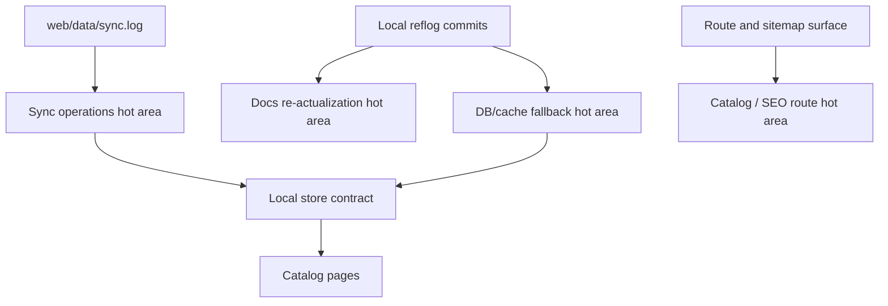

# Active Areas

The hottest areas are local catalog data, sync operations, catalog/SEO routes, and generated documentation; avoid broad refactors there until the current churn settles.

> [!NOTE]
> The requested precomputed `wiki/_git-signals.md` file is not present in this checkout. This page ranks active areas from the local reflog and operational sync log instead, so confidence is low.

## Signal basis

The Git history visible in this checkout has three branch commits: initial repository setup `c20e7c354b74d993effebf1009cb129c8dc12eb1`, DB snapshot/cache fallback work `39a7da579b04b7c57d4dc36faaea5d8fd30b2949`, and a documentation re-actualization reset `d4cf005af726ca394302a07e6ea389c9d9eae6f5` (`.git/logs/HEAD:1`, `.git/logs/HEAD:2`, `.git/logs/HEAD:3`). The local branch reflog repeats the same sequence, so there is no richer local branch activity to mine (`.git/logs/refs/heads/main:1`, `.git/logs/refs/heads/main:2`, `.git/logs/refs/heads/main:3`).

The operational log is more active than the commit log. It shows a large sync run starting with 2,000 cars in the DB and loading 50-car batches toward a 20,000-car target (`web/data/sync.log:1`, `web/data/sync.log:2`, `web/data/sync.log:3`, `web/data/sync.log:42`). It also shows repeated cron/runtime failures where `/home/ubuntu/.local/share/mise/installs/node/22.22.0/bin/npx` is missing (`web/data/sync.log:421`, `web/data/sync.log:422`, `web/data/sync.log:442`).

## Ranked active areas

| Rank | Area | Recent signal | What's in flight | Avoid refactoring now |
|---:|---|---|---|---|
| 1 | Sync runtime and cron path | `web/data/sync.log` has an active batch run and repeated missing-`npx` failures (`web/data/sync.log:1`, `web/data/sync.log:421`). | The batch importer is operationally hot because it is both the source of catalog freshness and the source of current cron failures. | Do not rename script paths, change working directory assumptions, or change cron command shape without updating deployment docs and runtime checks. |
| 2 | Local DB/cache persistence | Commit `39a7da579b04b7c57d4dc36faaea5d8fd30b2949` says the repo stopped tracking a large DB snapshot and added cache fallback (`.git/logs/HEAD:2`). | The project is stabilizing generated inventory outside Git while still bootstrapping from cache. | Do not change `data/db/cars.json`, `data/cache/cars.json`, or record shapes casually. |
| 3 | Catalog route and client filtering surface | Catalog pages read local data first, then fall back to live Encar data (`web/src/app/catalog/page.tsx:12`, `web/src/app/catalog/page.tsx:15`, `web/src/app/catalog/page.tsx:20`). | User-visible catalog behavior is concentrated in server page data choice and client in-memory filters. | Avoid splitting `CatalogClient` or changing filter parameter names until tests or route-level contracts exist. |
| 4 | SEO route inventory | Sitemap data enumerates brand, filter, combo, transmission, price, and model routes (`web/src/app/sitemap-data.ts:32`, `web/src/app/sitemap-data.ts:39`, `web/src/app/sitemap-data.ts:46`, `web/src/app/sitemap-data.ts:58`, `web/src/app/sitemap-data.ts:65`, `web/src/app/sitemap-data.ts:72`). | The route inventory is broad and tied to catalog discovery. | Do not remove or rename filter routes without updating sitemap data, internal sitemap page, and crawl expectations. |
| 5 | Lead capture and local operations | Lead capture appends to `data/leads.jsonl`; PM2 runs one process on port 3850 (`web/src/app/api/lead/route.ts:5`, `web/src/app/api/lead/route.ts:38`, `web/ecosystem.config.cjs:7`, `web/ecosystem.config.cjs:13`). | File-backed lead capture is simple but operationally sensitive. | Avoid adding multi-process deployment or high-volume lead writes before replacing local JSONL with a safer store. |
| 6 | Generated wiki and codebase re-actualization | Commit `d4cf005af726ca394302a07e6ea389c9d9eae6f5` resets auto-derived docs for full re-actualization (`.git/logs/HEAD:3`). | Documentation is being regenerated from code and may change across pages. | Do not treat generated wiki text as primary source; cite code and logs. |

## Area details

### 1. Sync runtime and cron path

The sync script's own header documents the cron command: `cd /home/ubuntu/apps/encar-parser/web && npx tsx scripts/sync-cars.ts >> data/sync.log 2>&1` (`web/scripts/sync-cars.ts:12`, `web/scripts/sync-cars.ts:13`). The log shows the sync did run and loaded thousands of rows in 50-car increments (`web/data/sync.log:3`, `web/data/sync.log:22`, `web/data/sync.log:42`, `web/data/sync.log:62`). The same log later shows repeated missing-`npx` failures from an absolute mise path (`web/data/sync.log:421`, `web/data/sync.log:430`, `web/data/sync.log:442`).

**What is in flight**: operational repair of the sync runtime environment, not just TypeScript code. The script depends on `MAX_TOTAL = 20000`, `BATCH_SIZE = 50`, randomized delays, and direct Encar fetches (`web/scripts/sync-cars.ts:31`, `web/scripts/sync-cars.ts:32`, `web/scripts/sync-cars.ts:33`, `web/scripts/sync-cars.ts:120`, `web/scripts/sync-cars.ts:231`).

**Avoid refactoring**: do not move `web/scripts/sync-cars.ts`, change `process.cwd()` assumptions, or replace `npx tsx` without proving the cron environment can find the executable.

### 2. Local DB/cache persistence

The hottest architectural change in Git history is DB snapshot removal and cache fallback, recorded as `39a7da579b04b7c57d4dc36faaea5d8fd30b2949` (`.git/logs/HEAD:2`). Runtime code now reads `data/db/cars.json` first and `data/cache/cars.json` second (`web/src/lib/car-store.ts:7`, `web/src/lib/car-store.ts:8`, `web/src/lib/car-store.ts:41`, `web/src/lib/car-store.ts:42`). A rebuild script maps cached cars into DB records with `status: "active"` (`web/scripts/rebuild-db-from-cache.ts:21`, `web/scripts/rebuild-db-from-cache.ts:22`, `web/scripts/rebuild-db-from-cache.ts:26`, `web/scripts/rebuild-db-from-cache.ts:28`).

**What is in flight**: the repo is keeping generated inventory out of Git while preserving local bootstrapping. Sync writes active plus booked records into the DB (`web/scripts/sync-cars.ts:291`, `web/scripts/sync-cars.ts:292`, `web/scripts/sync-cars.ts:308`, `web/scripts/sync-cars.ts:315`).

**Avoid refactoring**: do not change the DB shape, cache shape, or `status` semantics unless you update `car-store.ts`, `sync-cars.ts`, and `rebuild-db-from-cache.ts` together.

### 3. Catalog route and client filtering surface

The catalog page chooses local store cars when available and falls back to `fetchCars({ limit: 200 })` when empty (`web/src/app/catalog/page.tsx:12`, `web/src/app/catalog/page.tsx:13`, `web/src/app/catalog/page.tsx:15`, `web/src/app/catalog/page.tsx:16`, `web/src/app/catalog/page.tsx:20`). `CatalogClient` owns URL query parsing, query-param building, in-memory filtering, and sorting (`web/src/app/catalog/catalog-client.tsx:71`, `web/src/app/catalog/catalog-client.tsx:85`, `web/src/app/catalog/catalog-client.tsx:114`, `web/src/app/catalog/catalog-client.tsx:132`).

**What is in flight**: the public catalog's behavior is concentrated in one server page and one large client component. Detail pages also depend on local-first lookup plus live fallback (`web/src/app/catalog/[brand]/[carId]/page.tsx:38`, `web/src/app/catalog/[brand]/[carId]/page.tsx:39`, `web/src/app/catalog/[brand]/[carId]/page.tsx:41`, `web/src/app/catalog/[brand]/[carId]/page.tsx:45`).

**Avoid refactoring**: avoid changing URL parameter names, sort values, or `initialCars` shape while the persistence layer is also hot. Small fixes are safer than component decomposition.

### 4. SEO route inventory

The sitemap builds static route inventory from brand slugs, filters, fuel combos, transmission pages, price pages, and model pages (`web/src/app/sitemap-data.ts:29`, `web/src/app/sitemap-data.ts:32`, `web/src/app/sitemap-data.ts:39`, `web/src/app/sitemap-data.ts:46`, `web/src/app/sitemap-data.ts:58`, `web/src/app/sitemap-data.ts:65`, `web/src/app/sitemap-data.ts:72`). Brand pages generate static params from `getAllBrandSlugs()` (`web/src/app/catalog/[brand]/page.tsx:18`, `web/src/app/catalog/[brand]/page.tsx:19`).

**What is in flight**: route coverage and search discovery are coupled to inventory taxonomy. The SEO route inventory is broad, but it is manually enumerated in code.

**Avoid refactoring**: do not rename route slugs, remove filter pages, or change brand slug generation without updating sitemap and brand SEO data together.

### 5. Lead capture and local operations

The lead endpoint writes to `data/leads.jsonl` under the runtime working directory (`web/src/app/api/lead/route.ts:5`, `web/src/app/api/lead/route.ts:6`, `web/src/app/api/lead/route.ts:35`, `web/src/app/api/lead/route.ts:38`). The PM2 config starts one forked Next process on port 3850 (`web/ecosystem.config.cjs:6`, `web/ecosystem.config.cjs:7`, `web/ecosystem.config.cjs:8`, `web/ecosystem.config.cjs:13`, `web/ecosystem.config.cjs:14`).

**What is in flight**: the operational model is local-file-first. That makes small deployments simple, but it makes multi-process changes risky.

**Avoid refactoring**: do not increase PM2 instances, change `cwd`, or add background lead processors without replacing or protecting JSONL append semantics.

## Hotspot map for new agents

| If your task touches... | Treat as hot? | First files to inspect | Safer move |
|---|---:|---|---|
| Cron sync or data freshness | Yes | `web/scripts/sync-cars.ts`, `web/data/sync.log` | Fix runtime path and timeout issues before changing data shape. |
| DB/cache schema | Yes | `web/src/lib/car-store.ts`, `web/scripts/rebuild-db-from-cache.ts`, `web/scripts/sync-cars.ts` | Add compatibility reads before changing writers. |
| Catalog filters | Yes | `web/src/app/catalog/catalog-client.tsx`, `web/src/app/catalog/page.tsx` | Preserve existing query params; add new params additively. |
| SEO/filter routes | Medium | `web/src/app/sitemap-data.ts`, brand/filter route pages | Update sitemap and route together. |
| Lead capture | Medium | `web/src/app/api/lead/route.ts`, PM2 config | Add validation/rate limiting before scaling writes. |
| Generated docs | Medium | `.git/logs/HEAD` for reset commit | Re-derive claims from code, not prior generated text. |

## See also

- [deployment: troubleshooting](deployment.md#troubleshooting) — operational checks for the sync and app runtime.
- [gotchas: batch Encar fetches have no per-request timeout](gotchas.md#batch-encar-fetches-have-no-per-request-timeout) — current sync stability risk.
- [architecture: boundaries for safe changes](architecture.md#boundaries-for-safe-changes) — files to update together when touching hot areas.

## Backlinks

- [active-tasks](./active-tasks.md)
