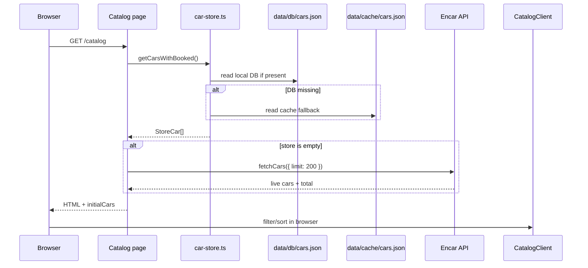

# System Architecture

The system is a file-backed Next.js catalog and parser toolchain that turns Encar.com listing data into Russian-language car pages and local lead records.

This page explains how the main containers connect and which invariants keep the architecture safe to change. For the product summary, see [overview: what this system is](overview.md#what-this-system-is). For the full decision log, see [decisions](decisions.md).

## C4 Container model

```mermaid
C4Container
  title Encar Parser / EncarKorea architecture

  Person(buyer, "Buyer", "Russian-speaking customer browsing Korean car listings")
  Person(operator, "Operator", "Runs sync/export scripts and reviews leads")

  System_Boundary(repo, "encar-parser") {
    Container(pycli, "Python parser CLI", "Python + requests", "Ad-hoc Encar export to JSON or CSV")
    Container(sync, "Sync scripts", "TypeScript / tsx", "Batch-import Encar listings into local JSON files")
    Container(web, "Next.js app", "Next.js 16 / React 19", "Catalog pages, API routes, lead capture, sitemap")
    ContainerDb(db, "Catalog DB", "Local JSON", "data/db/cars.json with active/booked records")
    ContainerDb(cache, "Seed cache", "Local JSON", "data/cache/cars.json and raw-api.json")
    ContainerDb(leads, "Lead log", "JSONL", "data/leads.jsonl append-only contact records")
  }

  System_Ext(encar, "Encar public API", "search/car/list/premium JSON listings")
  System_Ext(images, "Encar image CDN", "ci.encar.com vehicle photos")
  System_Ext(crawler, "Search crawlers", "Read sitemap, robots, HTML, and JSON-LD")

  buyer --> web : Uses catalog / forms over HTTPS
  operator --> pycli : Runs exports
  operator --> sync : Runs batch sync / cache rebuild
  pycli --> encar : Fetches pages with filters
  sync --> encar : Batch fetches Korean + imported cars
  sync --> db : Writes synchronized inventory
  sync --> cache : Seeds or rebuilds fallback data
  web --> db : Reads local store first
  web --> cache : Falls back when DB file is missing
  web --> encar : Live fallback for empty store / API route
  web --> images : Renders remote car photos
  web --> leads : Appends lead submissions
  crawler --> web : Reads sitemap, robots, route metadata
```

The architecture has one external data integration: the Encar premium search endpoint. Both parser runtimes define `https://api.encar.com/search/car/list/premium` as their search endpoint (`encar_parser.py:25`, `encar_parser.py:26`, `web/src/lib/encar-api.ts:1`, `web/src/lib/encar-api.ts:2`). The app also depends on Encar's image CDN, which Next.js explicitly allows as a remote image host (`web/src/lib/encar-api.ts:3`, `web/next.config.ts:4`, `web/next.config.ts:8`).

## Architectural constraints

| Constraint | Architectural effect | Evidence |
|---|---|---|
| The catalog is file-backed, not database-backed. | Runtime pages read local JSON files under `process.cwd()` and cache the decoded DB for 60 seconds. | `web/src/lib/car-store.ts:7`, `web/src/lib/car-store.ts:8`, `web/src/lib/car-store.ts:31`, `web/src/lib/car-store.ts:32` |
| The Encar API is undocumented in this repo. | Query construction stays close to the adapter code and uses browser-like headers. | `web/src/lib/encar-api.ts:232`, `web/src/lib/encar-api.ts:348`, `encar_parser.py:142`, `encar_parser.py:186` |
| The production process is single-instance. | Local file appends and process-local cache are acceptable for the current deployment shape. | `web/ecosystem.config.cjs:7`, `web/ecosystem.config.cjs:13`, `web/ecosystem.config.cjs:14`, `web/src/app/api/lead/route.ts:38` |
| SEO pages are part of the product surface. | Brand pages, filter pages, sitemap, robots, metadata, and JSON-LD live in the Next.js app. | `web/src/app/catalog/[brand]/page.tsx:18`, `web/src/app/sitemap-data.ts:27`, `web/src/app/robots.ts:3`, `web/src/app/catalog/[brand]/[carId]/page.tsx:165` |
| Operators still need ad-hoc exports. | The Python CLI remains separate from the web app and supports JSON/CSV output. | `run.py:31`, `run.py:82`, `run.py:84`, `encar_parser.py:287`, `encar_parser.py:295` |

> [!IMPORTANT]
> Keep path assumptions local to `web/`. The PM2 config sets `cwd` to `web/`, and store paths are relative to `process.cwd()` (`web/ecosystem.config.cjs:8`, `web/src/lib/car-store.ts:7`, `web/src/app/api/lead/route.ts:5`). Running the app from another directory changes where it reads DB/cache files and writes leads.

## Solution strategy

Three moves define the system shape.

1. **Local-first catalog rendering**. Server components prefer `car-store.ts`, then call the live Encar adapter only when the local store is empty (`web/src/app/page.tsx:79`, `web/src/app/page.tsx:86`, `web/src/app/catalog/page.tsx:13`, `web/src/app/catalog/page.tsx:15`). This serves normal traffic from local files and keeps a fresh checkout functional.
2. **Two parser surfaces, one external contract**. Python owns ad-hoc export workflows, while TypeScript owns web rendering and route handlers (`run.py:91`, `run.py:110`, `web/src/lib/encar-api.ts:299`, `web/src/app/api/cars/route.ts:2`). This duplicates mapping logic but avoids a separate backend service.
3. **Static SEO inventory around dynamic listings**. The app enumerates brand, filter, combo, transmission, price, and model sitemap entries, while detail pages render vehicle JSON-LD (`web/src/app/sitemap-data.ts:32`, `web/src/app/sitemap-data.ts:39`, `web/src/app/sitemap-data.ts:46`, `web/src/app/sitemap-data.ts:58`, `web/src/app/sitemap-data.ts:65`, `web/src/app/sitemap-data.ts:72`, `web/src/app/catalog/[brand]/[carId]/page.tsx:165`).

## Runtime view — catalog page data path



The catalog route passes local store data into the client component when available, or live Encar data when the local store is empty (`web/src/app/catalog/page.tsx:12`, `web/src/app/catalog/page.tsx:15`, `web/src/app/catalog/page.tsx:16`, `web/src/app/catalog/page.tsx:20`). `CatalogClient` then filters and sorts the received array in memory, so browser filters do not fetch a new server result set (`web/src/app/catalog/catalog-client.tsx:71`, `web/src/app/catalog/catalog-client.tsx:85`, `web/src/app/catalog/catalog-client.tsx:114`, `web/src/app/catalog/catalog-client.tsx:132`).

## Key architectural decisions

### 1. Public Encar API as the integration boundary

**Why**: The repo needs structured listings and photos without browser automation. Both runtimes call the JSON premium-list endpoint and parse `SearchResults` (`encar_parser.py:204`, `encar_parser.py:208`, `web/src/lib/encar-api.ts:354`, `web/src/lib/encar-api.ts:365`).

**Implication**: Filter syntax and headers are part of the architecture. The adapters construct `q=(And....)` filters and send browser-like headers (`encar_parser.py:161`, `encar_parser.py:186`, `web/src/lib/encar-api.ts:232`, `web/src/lib/encar-api.ts:348`). See [ADR-001](decisions.md#adr-001-use-the-public-encar-search-api-as-the-integration-boundary).

### 2. File-backed local inventory instead of a database service

**Why**: The deployment has one Next process and no DB client dependencies. `car-store.ts` reads JSON files directly, and sync scripts write JSON files directly (`web/src/lib/car-store.ts:2`, `web/src/lib/car-store.ts:7`, `web/scripts/sync-cars.ts:16`, `web/scripts/sync-cars.ts:195`).

**Implication**: The system is easy to run on one host, but it relies on local-disk semantics. Rebuild and sync scripts must preserve the DB shape expected by `car-store.ts` (`web/src/lib/car-store.ts:17`, `web/src/lib/car-store.ts:24`, `web/scripts/rebuild-db-from-cache.ts:22`, `web/scripts/rebuild-db-from-cache.ts:26`). See [ADR-004](decisions.md#adr-004-store-synchronized-catalog-data-in-local-json-files-and-ignore-large-db-snapshots).

### 3. Soft marketplace state: active plus bounded booked cars

**Why**: Listings disappear from Encar, but the catalog wants to keep a small, time-limited unavailable-car signal. The sync job converts a bounded subset of disappeared active records to `booked` with `bookedAt` (`web/scripts/sync-cars.ts:277`, `web/scripts/sync-cars.ts:280`, `web/scripts/sync-cars.ts:282`, `web/scripts/sync-cars.ts:283`).

**Implication**: UI code can show `booked` cars, but agents must not treat that state as a confirmed sale. The store interleaves booked cars into active results for display (`web/src/lib/car-store.ts:95`, `web/src/lib/car-store.ts:104`, `web/src/lib/car-store.ts:112`). See [ADR-005](decisions.md#adr-005-model-disappeared-listings-as-temporary-booked-records-during-synchronization).

### 4. Next.js route tree owns both SEO and API boundaries

**Why**: The site needs crawlable pages, a JSON cars API, a lead API, and XML sitemap output in one runtime. The route files define pages, metadata, and API handlers under `web/src/app` (`web/src/app/catalog/[brand]/page.tsx:22`, `web/src/app/api/cars/route.ts:4`, `web/src/app/api/lead/route.ts:8`, `web/src/app/api/sitemap-xml/route.ts:4`).

**Implication**: Page rendering, API behavior, and SEO artifacts are coupled by the App Router. Changing listing shape often touches both `encar-api.ts` and route/page components (`web/src/lib/encar-api.ts:121`, `web/src/app/catalog/[brand]/[carId]/page.tsx:77`). See [ADR-003](decisions.md#adr-003-use-nextjs-app-router-as-the-catalog-and-lead-generation-runtime) and [ADR-008](decisions.md#adr-008-build-seo-inventory-through-generated-brand-filter-sitemap-and-structured-data-routes).

### 5. Append-only local lead capture

**Why**: The deployed system has no database or CRM integration in the code, but it needs to persist contact submissions. The lead route appends JSON lines to `data/leads.jsonl` after validating `name` and `phone` (`web/src/app/api/lead/route.ts:5`, `web/src/app/api/lead/route.ts:14`, `web/src/app/api/lead/route.ts:21`, `web/src/app/api/lead/route.ts:38`).

**Implication**: Lead capture is simple and local, but operational review must read a file. The browser form and API payload are coupled by field names such as `carId`, `carTitle`, `carYear`, `carPrice`, and `carMileage` (`web/src/components/lead-form.tsx:47`, `web/src/components/lead-form.tsx:51`, `web/src/components/lead-form.tsx:56`). See [ADR-007](decisions.md#adr-007-persist-leads-as-append-only-jsonl-in-the-web-data-directory).

## Building blocks

| Module | Location | Architectural role | Key invariant |
|---|---|---|---|
| Python parser | `encar_parser.py`, `run.py` | Operator-facing export path for JSON/CSV snapshots. | `run.py` passes CLI options into `EncarParser.parse()` before saving output (`run.py:91`, `run.py:93`, `run.py:110`, `run.py:113`). |
| Encar web adapter | `web/src/lib/encar-api.ts` | Type definitions, Encar query builder, raw-to-`CarListing` mapper, live fetch fallback. | `parseCarFromApi()` owns slug, currency, labels, photo URLs, and detail URLs (`web/src/lib/encar-api.ts:173`, `web/src/lib/encar-api.ts:199`, `web/src/lib/encar-api.ts:213`, `web/src/lib/encar-api.ts:225`, `web/src/lib/encar-api.ts:226`). |
| Local car store | `web/src/lib/car-store.ts` | Server-only read facade for DB/cache files and brand stats. | It returns empty data on read/parse errors rather than throwing (`web/src/lib/car-store.ts:74`, `web/src/lib/car-store.ts:75`). |
| Sync pipeline | `web/scripts/sync-cars.ts`, `web/scripts/seed-cache.ts`, `web/scripts/rebuild-db-from-cache.ts` | Creates and repairs local inventory files. | Sync writes `cars: [...activeRecords, ...allBooked]` with sync metadata (`web/scripts/sync-cars.ts:311`, `web/scripts/sync-cars.ts:315`). |
| Page routes | `web/src/app/**/page.tsx` | Server-rendered landing, catalog, brand, filter, and detail pages. | Pages choose local data first, then fallback to Encar when needed (`web/src/app/page.tsx:86`, `web/src/app/catalog/[brand]/page.tsx:49`). |
| Client catalog | `web/src/app/catalog/catalog-client.tsx` | Browser-side filters, sorting, URL params, CTA insertion. | It filters only the `initialCars` array received from server rendering (`web/src/app/catalog/catalog-client.tsx:114`, `web/src/app/catalog/catalog-client.tsx:132`). |
| API routes | `web/src/app/api/*/route.ts` | Live cars proxy, lead capture, XML sitemap. | `/api/cars` caps `limit` at 200; `/api/lead` requires only name and phone (`web/src/app/api/cars/route.ts:7`, `web/src/app/api/lead/route.ts:14`). |
| SEO shell | `layout.tsx`, `robots.ts`, `sitemap-data.ts` | Organization JSON-LD, crawler rules, sitemap entries. | Robots disallow `/api/` while sitemap exposes public pages (`web/src/app/robots.ts:5`, `web/src/app/robots.ts:8`, `web/src/app/robots.ts:10`). |

## Crosscutting concepts and invariants

### Data shape ownership

`CarListing` in `web/src/lib/encar-api.ts` is the web-facing shape. It includes id, slug, manufacturer keys, prices in KRW/RUB, mileage, labels, photo URLs, detail URL, trust, and condition arrays (`web/src/lib/encar-api.ts:121`, `web/src/lib/encar-api.ts:122`, `web/src/lib/encar-api.ts:123`, `web/src/lib/encar-api.ts:131`, `web/src/lib/encar-api.ts:133`, `web/src/lib/encar-api.ts:145`, `web/src/lib/encar-api.ts:147`, `web/src/lib/encar-api.ts:148`). Store records wrap that parsed shape with `status` and optional `bookedAt` (`web/src/lib/car-store.ts:10`, `web/src/lib/car-store.ts:12`, `web/src/lib/car-store.ts:14`, `web/src/lib/car-store.ts:17`, `web/src/lib/car-store.ts:21`).

### Error handling posture

The architecture favors degraded empty results over hard failure for inventory reads. `car-store.ts` catches any load error and returns an empty DB (`web/src/lib/car-store.ts:74`, `web/src/lib/car-store.ts:75`). `fetchCars()` logs failed Encar HTTP or fetch errors and returns `{ cars: [], total: 0 }` (`web/src/lib/encar-api.ts:359`, `web/src/lib/encar-api.ts:361`, `web/src/lib/encar-api.ts:370`, `web/src/lib/encar-api.ts:372`). API routes convert user-visible failures into JSON errors (`web/src/app/api/cars/route.ts:12`, `web/src/app/api/cars/route.ts:14`, `web/src/app/api/lead/route.ts:43`, `web/src/app/api/lead/route.ts:45`).

### Caching and freshness

There are three freshness layers. `car-store.ts` caches the decoded local DB for 60 seconds (`web/src/lib/car-store.ts:31`, `web/src/lib/car-store.ts:32`, `web/src/lib/car-store.ts:36`). `fetchCars()` asks Next.js to revalidate live Encar fetches after 600 seconds (`web/src/lib/encar-api.ts:354`, `web/src/lib/encar-api.ts:356`). The sync script records `lastSync`, `totalOnEncar`, and `syncDurationSec` into the JSON DB after a batch run (`web/scripts/sync-cars.ts:311`, `web/scripts/sync-cars.ts:312`, `web/scripts/sync-cars.ts:313`, `web/scripts/sync-cars.ts:314`).

### Deployment locality

The PM2 config starts one Next process from `web/`, with `NODE_ENV=production`, `PORT=3850`, `instances: 1`, and `exec_mode: "fork"` (`web/ecosystem.config.cjs:6`, `web/ecosystem.config.cjs:7`, `web/ecosystem.config.cjs:8`, `web/ecosystem.config.cjs:10`, `web/ecosystem.config.cjs:11`, `web/ecosystem.config.cjs:13`, `web/ecosystem.config.cjs:14`). This matches local files and process-local cache. If you add multiple instances, revisit lead-file writes and cache freshness first.

## Architectural characteristics

Source: Richards & Ford, *Fundamentals of Software Architecture*, §4.

| Characteristic | Target | How achieved | Trade-off accepted |
|---|---|---|---|
| **Simplicity** | One deployable web process plus scripts. | Next app owns pages and API routes; JSON files replace external DB services (`web/package.json:8`, `web/ecosystem.config.cjs:13`, `web/src/lib/car-store.ts:7`). | File paths and process CWD become architectural constraints. |
| **Recoverability** | Recreate DB from cache or live sync. | `rebuild-db-from-cache.ts` maps cached cars into DB records; sync can regenerate active records from Encar (`web/scripts/rebuild-db-from-cache.ts:21`, `web/scripts/rebuild-db-from-cache.ts:26`, `web/scripts/sync-cars.ts:291`). | Recovery depends on local cache or Encar availability. |
| **SEO discoverability** | Crawlers see route inventory and metadata. | Sitemap entries enumerate brand/filter/model pages; robots publishes sitemap; detail pages render JSON-LD (`web/src/app/sitemap-data.ts:79`, `web/src/app/robots.ts:10`, `web/src/app/catalog/[brand]/[carId]/page.tsx:165`). | More routes must stay aligned with real inventory and filters. |
| **Degraded availability** | Empty stores and API failures do not crash pages. | Store and fetch adapters return empty results on errors (`web/src/lib/car-store.ts:74`, `web/src/lib/encar-api.ts:370`, `web/src/lib/encar-api.ts:372`). | Failures can appear as empty catalogs unless logs are watched. |
| **Operational locality** | All mutable state stays on the same host. | Catalog JSON, cache JSON, and lead JSONL live under `web/data` paths (`web/src/lib/car-store.ts:7`, `web/src/lib/car-store.ts:8`, `web/src/app/api/lead/route.ts:5`). | Host disk backup becomes important; horizontal deployment is not automatic. |
| **Change isolation** | UI filters change without server API changes. | `CatalogClient` reads query params and filters the initial array client-side (`web/src/app/catalog/catalog-client.tsx:71`, `web/src/app/catalog/catalog-client.tsx:114`). | Filters only apply to loaded cars, not the full Encar corpus. |

### Explicitly not optimized for

- **Multi-writer consistency**: accepted for v1 because the configured deployment uses one forked process and local files (`web/ecosystem.config.cjs:13`, `web/ecosystem.config.cjs:14`). Revisit before adding multiple app instances or background lead processors.
- **Real-time inventory accuracy**: accepted for v1 because local store reads, 60-second in-process cache, 600-second live revalidation, and scheduled sync each add freshness delay (`web/src/lib/car-store.ts:32`, `web/src/lib/encar-api.ts:356`, `web/scripts/sync-cars.ts:311`). Revisit if users rely on exact availability.
- **Deep analytical querying**: not a goal. The store is JSON arrays, and brand stats are computed in process by scanning cars (`web/src/lib/car-store.ts:139`, `web/src/lib/car-store.ts:147`, `web/src/lib/car-store.ts:153`). Use a database if reporting becomes a product feature.

## Boundaries for safe changes

| If you change... | Check these boundaries |
|---|---|
| Encar query filters | Update both Python and TypeScript adapters if the filter belongs to both CLI and web (`encar_parser.py:150`, `web/src/lib/encar-api.ts:299`). |
| `CarListing` fields | Update parser mapping, store assumptions, catalog cards, detail specs, lead payloads, and schema generation call sites (`web/src/lib/encar-api.ts:121`, `web/src/app/catalog/[brand]/[carId]/page.tsx:77`, `web/src/components/lead-form.tsx:47`). |
| DB record shape | Update `sync-cars.ts`, `rebuild-db-from-cache.ts`, and `car-store.ts` together (`web/scripts/sync-cars.ts:41`, `web/scripts/rebuild-db-from-cache.ts:22`, `web/src/lib/car-store.ts:17`). |
| Lead payload | Update both `LeadForm` and `/api/lead`, because there is no shared schema object (`web/src/components/lead-form.tsx:47`, `web/src/app/api/lead/route.ts:12`). |
| Public route inventory | Update sitemap data and robots assumptions when adding or removing crawlable surfaces (`web/src/app/sitemap-data.ts:27`, `web/src/app/robots.ts:8`). |

## See also

- [overview: web request model](overview.md#web-request-model) — short route-by-route orientation.
- [decisions: ADR-004](decisions.md#adr-004-store-synchronized-catalog-data-in-local-json-files-and-ignore-large-db-snapshots) — why JSON files are the persistence model.
- [decisions: ADR-009](decisions.md#adr-009-deploy-as-one-forked-nextjs-process-on-port-3850) — why the deployment assumes one Next process.
- [deployment (planned)](deployment.md) — commands, sync schedule, and operational paths.
- [gotchas (planned)](gotchas.md) — failure modes and repair steps.

## Backlinks

- [active-areas](./active-areas.md)
- [decisions](./decisions.md)
- [deployment](./deployment.md)
- [gaps](./gaps.md)
- [gotchas](./gotchas.md)
- [overview](./overview.md)
