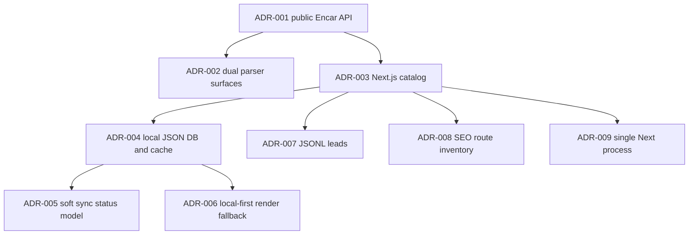

# Architecture Decision Records

These ADRs record the architectural decisions that shape the Encar parser, local catalog store, and Next.js lead-generation site.

Commit history is short: the local reflog shows an initial repository commit `c20e7c354b74d993effebf1009cb129c8dc12eb1`, a data-snapshot/cache commit `39a7da579b04b7c57d4dc36faaea5d8fd30b2949`, and a documentation reset commit `d4cf005af726ca394302a07e6ea389c9d9eae6f5` (`.git/logs/HEAD:1`, `.git/logs/HEAD:2`, `.git/logs/HEAD:3`). The remote points at `https://github.com/VKirill/encar-parser.git`, so these hashes identify the repository history, not a fork-local experiment (`.git/config:6`, `.git/config:7`).

> [!NOTE]
> The requested `wiki/_git-signals.md` file was absent in this checkout. The evidence below cites the local reflog and source files instead.

## ADR-001: Use the public Encar search API as the integration boundary

### Context

The system needs current vehicle listings, prices, photos, dealer metadata, and filterable search dimensions. Both the Python parser and the web adapter point at the same Encar premium-list endpoint instead of scraping rendered HTML (`encar_parser.py:25`, `encar_parser.py:26`, `web/src/lib/encar-api.ts:1`, `web/src/lib/encar-api.ts:2`). They also share the same photo and detail URL concepts (`encar_parser.py:27`, `encar_parser.py:28`, `web/src/lib/encar-api.ts:3`, `web/src/lib/encar-api.ts:4`).

The integration must send browser-like headers because the API is a third-party public endpoint. The Python parser uses `requests.Session` with a fake Chrome user agent, JSON accept header, Korean language preference, and Encar referer (`encar_parser.py:140`, `encar_parser.py:142`, `encar_parser.py:143`, `encar_parser.py:144`, `encar_parser.py:145`, `encar_parser.py:146`). The TypeScript adapter defines equivalent fetch headers (`web/src/lib/encar-api.ts:232`, `web/src/lib/encar-api.ts:233`, `web/src/lib/encar-api.ts:235`, `web/src/lib/encar-api.ts:236`, `web/src/lib/encar-api.ts:237`).

How can the project obtain car listings reliably enough for a catalog, while avoiding a browser automation dependency?

### Decision

Use Encar's public JSON search endpoint as the external integration boundary. Encode filters in Encar's `q=(And....)` query syntax and page with the `sr` parameter (`encar_parser.py:150`, `encar_parser.py:186`, `encar_parser.py:197`, `web/src/lib/encar-api.ts:317`, `web/src/lib/encar-api.ts:348`, `web/src/lib/encar-api.ts:349`).

Considered options:

1. **Public JSON API** — call `search/car/list/premium`, parse `SearchResults`, and map data into project-owned listing types (`encar_parser.py:204`, `encar_parser.py:206`, `encar_parser.py:208`, `web/src/lib/encar-api.ts:364`, `web/src/lib/encar-api.ts:365`, `web/src/lib/encar-api.ts:367`).
2. **HTML scraping** — scrape Encar pages. No browser automation or HTML parser exists in the current dependencies; Python only depends on `requests` and `fake-useragent` (`requirements.txt:1`, `requirements.txt:2`).
3. **Manual CSV ingestion** — import listings manually. The parser already supports automated JSON and CSV export, so manual import would duplicate a solved path (`encar_parser.py:287`, `encar_parser.py:295`).

**Y-statement**: In the context of **fetching Encar vehicle inventory**, facing **a need for structured listings without maintaining browser automation**, we decided for **the public Encar JSON API** and against **HTML scraping**, to achieve **typed, filterable listing ingestion**, accepting **dependence on an undocumented third-party endpoint and its query grammar**.

### Status

accepted

### Evidence

- Commit `c20e7c354b74d993effebf1009cb129c8dc12eb1` initialized the repository containing the parser/API integration (`.git/logs/HEAD:1`).
- Current Python endpoint constants live in `encar_parser.py:25` and `encar_parser.py:26`.
- Current TypeScript endpoint constants live in `web/src/lib/encar-api.ts:1` and `web/src/lib/encar-api.ts:2`.

## ADR-002: Keep a root Python parser for exports and a TypeScript adapter for the web app

### Context

The repository serves two different use cases. The root CLI fetches cars and writes JSON or CSV for ad-hoc exports (`run.py:31`, `run.py:82`, `run.py:84`, `run.py:110`, `run.py:113`). The web app needs typed data in the shape used by pages and components, including ruble prices, Russian labels, slugs, and image arrays (`web/src/lib/encar-api.ts:121`, `web/src/lib/encar-api.ts:131`, `web/src/lib/encar-api.ts:133`, `web/src/lib/encar-api.ts:136`, `web/src/lib/encar-api.ts:145`).

The Python CLI exposes parser controls like max count, page size, delay, manufacturer, fuel, price, mileage, year, and car type (`run.py:54`, `run.py:56`, `run.py:61`, `run.py:65`, `run.py:67`, `run.py:69`, `run.py:73`, `run.py:75`, `run.py:77`). The Next.js app uses TypeScript types and `server-only` store reads in the same runtime as route handlers and server components (`web/src/lib/car-store.ts:1`, `web/src/lib/car-store.ts:4`).

How can the project support both operator exports and web rendering without forcing one runtime to own both concerns?

### Decision

Maintain two adapter implementations. The Python implementation owns CLI/export workflows, while the TypeScript implementation owns web rendering, route handlers, and local store typing (`encar_parser.py:137`, `run.py:91`, `web/src/lib/encar-api.ts:299`, `web/src/app/api/cars/route.ts:2`).

Considered options:

1. **Single Python backend for everything** — centralizes Encar parsing, but would require the Next.js app to call another service or consume generated files for every page.
2. **Single TypeScript implementation only** — keeps all logic in `web/`, but drops the existing CLI export interface and Python CSV writer (`run.py:110`, `encar_parser.py:295`).
3. **Two adapters with shared integration contract** — duplicates Encar mapping logic, but keeps each runtime local to its use case.

**Y-statement**: In the context of **operating both a parser CLI and a server-rendered catalog**, facing **different runtime needs for exports and page rendering**, we decided for **separate Python and TypeScript Encar adapters** and against **a single cross-runtime service**, to achieve **simple CLI exports and direct Next.js data access**, accepting **duplicated mapping constants and filter grammar**.

### Status

accepted

### Evidence

- Commit `c20e7c354b74d993effebf1009cb129c8dc12eb1` initialized the repository containing both surfaces (`.git/logs/HEAD:1`).
- Python CLI wiring appears in `run.py:91` through `run.py:114`.
- TypeScript web fetch wiring appears in `web/src/lib/encar-api.ts:299` through `web/src/lib/encar-api.ts:373`.

## ADR-003: Use Next.js App Router as the catalog and lead-generation runtime

### Context

The web product needs server-rendered landing pages, brand pages, car detail pages, API handlers, sitemap output, and client-side filters. The `web/package.json` scripts run Next on port `3850`, and the app depends on Next, React, React DOM, TypeScript, Tailwind, and `server-only` (`web/package.json:5`, `web/package.json:6`, `web/package.json:8`, `web/package.json:19`, `web/package.json:21`, `web/package.json:22`, `web/package.json:23`, `web/package.json:24`, `web/package.json:25`).

The route tree uses App Router conventions: `page.tsx` server components, API route modules, metadata exports, dynamic route params, and generated static brand params (`web/src/app/page.tsx:77`, `web/src/app/catalog/page.tsx:12`, `web/src/app/api/cars/route.ts:4`, `web/src/app/catalog/[brand]/page.tsx:18`, `web/src/app/catalog/[brand]/[carId]/page.tsx:16`).

How can the site combine SEO pages, server-side data reads, and selective client interactivity in one deployment unit?

### Decision

Use a Next.js App Router application under `web/` as the catalog runtime. Server pages load local or live car data, while client components handle interactive filtering and lead modals (`web/src/app/catalog/page.tsx:20`, `web/src/app/catalog/catalog-client.tsx:1`, `web/src/components/lead-form.tsx:1`).

Considered options:

1. **Next.js App Router** — fits server pages, route handlers, metadata, sitemap, and client islands in one project.
2. **Static-site generator plus periodic rebuild** — simplifies runtime but cannot serve `/api/lead` and live fallback API routes without another service (`web/src/app/api/lead/route.ts:8`, `web/src/app/api/cars/route.ts:4`).
3. **Separate backend and SPA frontend** — isolates APIs, but adds a deployment unit not present in the repo.

**Y-statement**: In the context of **a Russian-language Encar catalog with lead capture**, facing **SEO page needs plus dynamic inventory and form submission**, we decided for **a Next.js App Router app** and against **a static-only or split backend/frontend design**, to achieve **one deployable web runtime**, accepting **that server file access and route handlers live in the same Node process**.

### Status

accepted

### Evidence

- Commit `c20e7c354b74d993effebf1009cb129c8dc12eb1` initialized the repository containing the Next app (`.git/logs/HEAD:1`).
- Next and React dependencies are declared in `web/package.json:19` through `web/package.json:22`.
- App Router pages and API routes are present at `web/src/app/page.tsx:77`, `web/src/app/catalog/page.tsx:12`, `web/src/app/api/cars/route.ts:4`, and `web/src/app/api/lead/route.ts:8`.

## ADR-004: Store synchronized catalog data in local JSON files and ignore large DB snapshots

### Context

The web runtime needs inventory data without requiring Postgres, Redis, or another database. `car-store.ts` reads `data/db/cars.json` and falls back to `data/cache/cars.json` (`web/src/lib/car-store.ts:7`, `web/src/lib/car-store.ts:8`, `web/src/lib/car-store.ts:40`, `web/src/lib/car-store.ts:41`). The repo ignores `web/data/db/*.json`, which prevents generated DB snapshots from being committed (`.gitignore:12`).

The second commit explicitly stopped tracking a large DB snapshot and added a cache fallback (`.git/logs/HEAD:2`). The rebuild script converts `data/cache/cars.json` into `data/db/cars.json` when a DB file needs to be recreated (`web/scripts/rebuild-db-from-cache.ts:6`, `web/scripts/rebuild-db-from-cache.ts:15`, `web/scripts/rebuild-db-from-cache.ts:22`, `web/scripts/rebuild-db-from-cache.ts:33`, `web/scripts/rebuild-db-from-cache.ts:34`).

How can the site keep inventory available locally while avoiding large generated data in Git?

### Decision

Use local JSON files as the persistence model for synchronized catalog data. Commit source and scripts, ignore generated DB snapshots, and provide a cache-to-DB rebuild path (`.gitignore:12`, `web/scripts/rebuild-db-from-cache.ts:21`, `web/scripts/rebuild-db-from-cache.ts:26`).

Considered options:

1. **Commit generated DB snapshots** — makes fresh checkout data-rich, but bloats Git and couples code review to scraped inventory changes.
2. **Use a managed database** — supports query semantics and concurrent writes, but adds infrastructure absent from package scripts and config.
3. **Use ignored JSON DB plus cache fallback** — keeps deployment simple and avoids large committed snapshots, but gives up database constraints and concurrent write protection.

**Y-statement**: In the context of **serving synchronized car inventory**, facing **large generated data and no dedicated database service**, we decided for **ignored local JSON DB files with a cache fallback** and against **committing DB snapshots**, to achieve **small source history and local data availability**, accepting **file-based durability and manual rebuild semantics**.

### Status

accepted

### Evidence

- Commit `39a7da579b04b7c57d4dc36faaea5d8fd30b2949` is recorded as `chore: stop tracking large DB snapshot and add cache fallback` (`.git/logs/HEAD:2`).
- `.gitignore` excludes `web/data/db/*.json` (`.gitignore:12`).
- `car-store.ts` falls back from DB to cache (`web/src/lib/car-store.ts:41`, `web/src/lib/car-store.ts:42`, `web/src/lib/car-store.ts:54`).
- `rebuild-db-from-cache.ts` writes the DB from cache (`web/scripts/rebuild-db-from-cache.ts:22`, `web/scripts/rebuild-db-from-cache.ts:34`).

## ADR-005: Model disappeared listings as temporary `booked` records during synchronization

### Context

Encar listings can disappear between syncs. The storefront wants to show some recently unavailable cars as booked, but should not let them accumulate forever. The sync script defines `active` and `booked` statuses, `bookedAt`, a 24-hour booked TTL, a 6% booked ratio, and a maximum of 30 booked records (`web/scripts/sync-cars.ts:41`, `web/scripts/sync-cars.ts:43`, `web/scripts/sync-cars.ts:44`, `web/scripts/sync-cars.ts:36`, `web/scripts/sync-cars.ts:37`, `web/scripts/sync-cars.ts:38`).

The store exposes both active-only cars and a mixed active/booked list. `getCarsWithBooked()` inserts one booked car after each seven active cars, then appends remaining booked cars, which makes booked listings part of the catalog display model (`web/src/lib/car-store.ts:89`, `web/src/lib/car-store.ts:94`, `web/src/lib/car-store.ts:95`, `web/src/lib/car-store.ts:104`, `web/src/lib/car-store.ts:112`, `web/src/lib/car-store.ts:118`).

How can the catalog reflect marketplace churn without deleting disappeared listings immediately?

### Decision

Treat a bounded subset of disappeared active listings as temporary `booked` records. Keep existing booked records while they are younger than 24 hours, prevent duplicates with fresh active listings, and remove expired booked records (`web/scripts/sync-cars.ts:277`, `web/scripts/sync-cars.ts:282`, `web/scripts/sync-cars.ts:299`, `web/scripts/sync-cars.ts:303`, `web/scripts/sync-cars.ts:306`, `web/scripts/sync-cars.ts:330`).

Considered options:

1. **Delete disappeared cars immediately** — keeps data closest to Encar, but removes social proof and unavailable-car context.
2. **Keep all disappeared cars indefinitely** — preserves history, but stale inventory can dominate a small catalog.
3. **Keep bounded temporary booked records** — preserves some churn signal while limiting stale data.

**Y-statement**: In the context of **synchronizing a third-party vehicle marketplace into a storefront**, facing **listing churn and stale-data risk**, we decided for **bounded temporary `booked` records** and against **immediate deletion or indefinite retention**, to achieve **a visible availability state with limited staleness**, accepting **that `booked` is inferred from disappearance, not confirmed sale data**.

### Status

accepted

### Evidence

- Commit `c20e7c354b74d993effebf1009cb129c8dc12eb1` initialized the synchronization codebase (`.git/logs/HEAD:1`).
- Commit `39a7da579b04b7c57d4dc36faaea5d8fd30b2949` changed DB snapshot/cache handling, which supports the file-backed sync model (`.git/logs/HEAD:2`).
- Sync converts disappeared active cars into booked records at `web/scripts/sync-cars.ts:277` through `web/scripts/sync-cars.ts:289`.
- Store display interleaves booked records at `web/src/lib/car-store.ts:104` through `web/src/lib/car-store.ts:124`.

## ADR-006: Render pages from the local store first, then fall back to live Encar fetches

### Context

The site must work when a local DB exists, but it should still render useful pages in a fresh checkout or after DB loss. The home page reads local store data first and calls `fetchCars()` only when the store is empty (`web/src/app/page.tsx:77`, `web/src/app/page.tsx:79`, `web/src/app/page.tsx:80`, `web/src/app/page.tsx:86`, `web/src/app/page.tsx:87`). The catalog page follows the same pattern with `getCarsWithBooked()` and `fetchCars({ limit: 200 })` (`web/src/app/catalog/page.tsx:12`, `web/src/app/catalog/page.tsx:13`, `web/src/app/catalog/page.tsx:15`, `web/src/app/catalog/page.tsx:16`).

Brand and detail routes also prefer local data, then call the API adapter when needed (`web/src/app/catalog/[brand]/page.tsx:45`, `web/src/app/catalog/[brand]/page.tsx:49`, `web/src/app/catalog/[brand]/[carId]/page.tsx:38`, `web/src/app/catalog/[brand]/[carId]/page.tsx:39`). Filter pages use a local filtered set, then fetch a filtered live set when the local result is empty (`web/src/app/catalog/(filters)/electric/page.tsx:13`, `web/src/app/catalog/(filters)/electric/page.tsx:15`, `web/src/app/catalog/(filters)/electric/page.tsx:18`, `web/src/app/catalog/(filters)/electric/page.tsx:19`).

How can the site prefer fast local data while staying useful when local files are missing or empty?

### Decision

Use local-first rendering with live API fallback. Server components read `car-store.ts` first; when it returns no usable cars, they call the TypeScript Encar adapter.

Considered options:

1. **Local-only rendering** — reduces third-party API calls, but fresh checkouts and failed syncs render empty pages.
2. **Live-only rendering** — avoids file freshness problems, but every server page depends directly on Encar availability.
3. **Local-first with live fallback** — makes normal reads file-local and keeps empty stores usable.

**Y-statement**: In the context of **server-rendering catalog pages from generated inventory**, facing **local-file freshness and third-party API availability concerns**, we decided for **local-first reads with live Encar fallback** and against **local-only or live-only rendering**, to achieve **fast normal page loads and graceful empty-store behavior**, accepting **two data paths that can diverge in shape or freshness**.

### Status

accepted

### Evidence

- Commit `39a7da579b04b7c57d4dc36faaea5d8fd30b2949` added the cache fallback basis for local-first reads (`.git/logs/HEAD:2`).
- The home route fallback is in `web/src/app/page.tsx:86` through `web/src/app/page.tsx:93`.
- The catalog route fallback is in `web/src/app/catalog/page.tsx:15` through `web/src/app/catalog/page.tsx:20`.
- Brand/detail fallbacks are in `web/src/app/catalog/[brand]/page.tsx:49` and `web/src/app/catalog/[brand]/[carId]/page.tsx:39`.

## ADR-007: Persist leads as append-only JSONL in the web data directory

### Context

The site collects buyer contacts from a client modal. The form sends `name`, `phone`, `comment`, and selected car context to `/api/lead` (`web/src/components/lead-form.tsx:37`, `web/src/components/lead-form.tsx:44`, `web/src/components/lead-form.tsx:47`, `web/src/components/lead-form.tsx:51`, `web/src/components/lead-form.tsx:52`). The route validates only `name` and `phone`, then writes each lead as one JSON line under `data/leads.jsonl` (`web/src/app/api/lead/route.ts:5`, `web/src/app/api/lead/route.ts:6`, `web/src/app/api/lead/route.ts:14`, `web/src/app/api/lead/route.ts:21`, `web/src/app/api/lead/route.ts:38`).

No external CRM, email service, or relational database is configured in the dependency list or app configuration (`web/package.json:14`, `web/package.json:26`, `web/ecosystem.config.cjs:9`).

How can the site capture leads with the fewest moving parts in a single-server deployment?

### Decision

Persist leads as append-only JSONL on local disk. The API creates the data directory when needed, appends UTF-8 JSON, logs a summary, and returns `{ ok: true }` (`web/src/app/api/lead/route.ts:34`, `web/src/app/api/lead/route.ts:35`, `web/src/app/api/lead/route.ts:36`, `web/src/app/api/lead/route.ts:38`, `web/src/app/api/lead/route.ts:40`, `web/src/app/api/lead/route.ts:42`).

Considered options:

1. **JSONL local file** — works in one Node process without external services, and supports append-only ingestion.
2. **Relational database table** — supports queries and constraints, but no DB connection or schema exists in the repo.
3. **External CRM webhook** — routes leads directly to sales tooling, but adds a network dependency and credentials not present in config.

**Y-statement**: In the context of **capturing buyer leads from the catalog**, facing **single-process deployment and no configured database or CRM**, we decided for **append-only JSONL files** and against **database or webhook-first storage**, to achieve **minimal lead persistence**, accepting **manual processing, weak validation, and local-disk durability limits**.

### Status

accepted

### Evidence

- Commit `c20e7c354b74d993effebf1009cb129c8dc12eb1` initialized the repository containing the lead route (`.git/logs/HEAD:1`).
- The lead route appends to `data/leads.jsonl` at `web/src/app/api/lead/route.ts:5` through `web/src/app/api/lead/route.ts:38`.
- The client form sends car context at `web/src/components/lead-form.tsx:47` through `web/src/components/lead-form.tsx:56`.

## ADR-008: Build SEO inventory through generated brand, filter, sitemap, and structured-data routes

### Context

The product depends on discoverable catalog pages, not only a search UI. Brand pages generate static params from all brand slugs and use brand SEO metadata (`web/src/app/catalog/[brand]/page.tsx:18`, `web/src/app/catalog/[brand]/page.tsx:22`, `web/src/app/catalog/[brand]/page.tsx:28`, `web/src/app/catalog/[brand]/page.tsx:30`). Filter landing pages such as electric cars have their own metadata and filtered catalog payload (`web/src/app/catalog/(filters)/electric/page.tsx:6`, `web/src/app/catalog/(filters)/electric/page.tsx:12`, `web/src/app/catalog/(filters)/electric/page.tsx:15`, `web/src/app/catalog/(filters)/electric/page.tsx:49`).

The sitemap generator enumerates the home page, catalog page, sitemap page, all brand pages, filter pages, combo pages, transmission pages, price pages, and model pages (`web/src/app/sitemap-data.ts:4`, `web/src/app/sitemap-data.ts:5`, `web/src/app/sitemap-data.ts:7`, `web/src/app/sitemap-data.ts:9`, `web/src/app/sitemap-data.ts:10`, `web/src/app/sitemap-data.ts:18`, `web/src/app/sitemap-data.ts:79`). Car detail pages emit `Vehicle` structured data through `generateVehicleSchema()` (`web/src/app/catalog/[brand]/[carId]/page.tsx:10`, `web/src/app/catalog/[brand]/[carId]/page.tsx:165`, `web/src/app/catalog/[brand]/[carId]/page.tsx:168`).

How can the catalog expose crawlable entry points for brands, filters, and individual cars while sharing one inventory source?

### Decision

Use generated SEO route inventory inside the Next.js app. Brand pages, filter pages, sitemap entries, robots configuration, and JSON-LD structured data live alongside the catalog pages (`web/src/app/robots.ts:3`, `web/src/app/robots.ts:10`, `web/src/app/api/sitemap-xml/route.ts:4`, `web/src/app/api/sitemap-xml/route.ts:19`, `web/src/app/layout.tsx:27`).

Considered options:

1. **Only `/catalog` with client-side filters** — easiest to maintain, but weak for crawler-specific landing pages.
2. **Separate static SEO site** — can optimize content independently, but duplicates inventory routing.
3. **SEO route inventory in Next.js** — keeps crawlable pages, sitemap, and data reads in the same app.

**Y-statement**: In the context of **a vehicle catalog that needs search traffic**, facing **crawler discoverability and shared inventory concerns**, we decided for **generated SEO routes and sitemap entries inside Next.js** and against **client-filter-only catalog discovery**, to achieve **crawlable brand/filter/detail surfaces**, accepting **a larger route inventory that must stay aligned with available filters and brands**.

### Status

accepted

### Evidence

- Commit `c20e7c354b74d993effebf1009cb129c8dc12eb1` initialized the repository containing the SEO route structure (`.git/logs/HEAD:1`).
- Sitemap inventory is built in `web/src/app/sitemap-data.ts:27` through `web/src/app/sitemap-data.ts:90`.
- Robots points crawlers to the sitemap and disallows `/api/` at `web/src/app/robots.ts:3` through `web/src/app/robots.ts:10`.
- Vehicle structured data is rendered in `web/src/app/catalog/[brand]/[carId]/page.tsx:165` through `web/src/app/catalog/[brand]/[carId]/page.tsx:168`.

## ADR-009: Deploy as one forked Next.js process on port 3850

### Context

The application reads and writes local files under `process.cwd()`, including car DB/cache files and leads (`web/src/lib/car-store.ts:7`, `web/src/lib/car-store.ts:8`, `web/src/app/api/lead/route.ts:5`, `web/src/app/api/lead/route.ts:6`). The PM2 ecosystem config starts `node_modules/.bin/next start --port 3850` from the `web/` directory with one instance in fork mode (`web/ecosystem.config.cjs:4`, `web/ecosystem.config.cjs:6`, `web/ecosystem.config.cjs:7`, `web/ecosystem.config.cjs:8`, `web/ecosystem.config.cjs:13`, `web/ecosystem.config.cjs:14`).

The package scripts also standardize development and production ports at `3850` (`web/package.json:6`, `web/package.json:8`). Because leads are appended to a local file and the car store caches JSON in process memory, multi-instance scaling would need explicit coordination not present in the repo (`web/src/lib/car-store.ts:31`, `web/src/app/api/lead/route.ts:38`).

How can deployment keep file-backed state coherent without adding distributed storage?

### Decision

Run one forked Next.js process from the `web/` working directory on port `3850`. Keep local file paths relative to that working directory and avoid multi-instance writes to `data/leads.jsonl` or divergent in-memory store caches.

Considered options:

1. **One forked Next.js process** — matches local file-backed state and package scripts.
2. **Clustered Next.js instances on one host** — increases parallelism, but concurrent JSONL appends and per-process caches need review.
3. **Horizontally scaled instances** — requires shared storage or a real database for leads and catalog snapshots.

**Y-statement**: In the context of **deploying a file-backed Next.js catalog**, facing **local disk writes and process-local cache state**, we decided for **one forked Next process on port 3850** and against **clustered or horizontally scaled instances**, to achieve **coherent local file semantics**, accepting **single-process throughput and availability limits**.

### Status

accepted

### Evidence

- Commit `c20e7c354b74d993effebf1009cb129c8dc12eb1` initialized the repository containing the web deployment config (`.git/logs/HEAD:1`).
- `web/ecosystem.config.cjs` sets the process name, script, port, CWD, one instance, and fork mode (`web/ecosystem.config.cjs:4`, `web/ecosystem.config.cjs:6`, `web/ecosystem.config.cjs:7`, `web/ecosystem.config.cjs:8`, `web/ecosystem.config.cjs:13`, `web/ecosystem.config.cjs:14`).
- Package scripts use port `3850` for development and production start (`web/package.json:6`, `web/package.json:8`).

## See also

- [overview](overview.md#what-this-system-is) — system map and start points for new agents.
- [architecture (planned)](architecture.md) — container-level structure and architectural characteristics.
- [data model (planned)](data-model.md) — JSON DB, cache, lead, and listing schemas.
- [deployment (planned)](deployment.md) — operational commands and sync schedule.

## Backlinks

- [architecture](./architecture.md)
- [deployment](./deployment.md)
- [gotchas](./gotchas.md)
