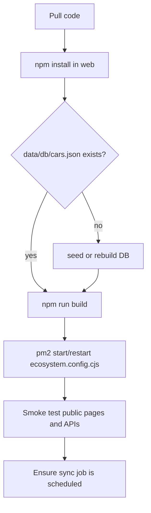

# Deployment Runbook

Deploy the `web/` Next.js catalog as one PM2-managed process on port `3850`, with local JSON inventory files and JSONL lead capture.

This page is an operations procedure. For the architectural reason behind the single-process, file-backed shape, see [decisions: deploy one forked Next process](decisions.md#adr-009-deploy-as-one-forked-nextjs-process-on-port-3850).

## Prerequisites

| Requirement | Why it matters | Evidence |
|---|---|---|
| Node.js/npm capable of installing Next.js 16 and React 19 dependencies. | The web package depends on `next`, `react`, `react-dom`, TypeScript, Tailwind, and `server-only`. | `web/package.json:14`, `web/package.json:19`, `web/package.json:21`, `web/package.json:22`, `web/package.json:23`, `web/package.json:24`, `web/package.json:25` |
| Run commands from `/home/ubuntu/apps/encar-parser/web` for the web app. | Runtime paths use `process.cwd()` for `data/db`, `data/cache`, and `data/leads.jsonl`. PM2 sets `cwd` to the `web/` directory. | `web/ecosystem.config.cjs:8`, `web/src/lib/car-store.ts:7`, `web/src/lib/car-store.ts:8`, `web/src/app/api/lead/route.ts:5`, `web/src/app/api/lead/route.ts:6` |
| PM2 or compatible process manager. | The repository includes an ecosystem config that starts one forked Next process. | `web/ecosystem.config.cjs:1`, `web/ecosystem.config.cjs:2`, `web/ecosystem.config.cjs:6`, `web/ecosystem.config.cjs:13`, `web/ecosystem.config.cjs:14` |
| Local writable `web/data` directory. | Sync writes `data/db/cars.json`; lead capture appends `data/leads.jsonl`; cache seed writes `data/cache`. | `web/scripts/sync-cars.ts:27`, `web/scripts/sync-cars.ts:28`, `web/scripts/sync-cars.ts:195`, `web/scripts/sync-cars.ts:197`, `web/src/app/api/lead/route.ts:35`, `web/src/app/api/lead/route.ts:38` |
| Network access to Encar. | Sync, cache seed, live fallback, and `/api/cars` all call `https://api.encar.com/search/car/list/premium`. | `web/scripts/sync-cars.ts:19`, `web/scripts/seed-cache.ts:9`, `web/src/lib/encar-api.ts:1`, `web/src/lib/encar-api.ts:2`, `web/src/app/api/cars/route.ts:10` |

> [!IMPORTANT]
> Keep `web/` as the working directory for app runtime and data scripts. If `process.cwd()` is the repository root, the app reads and writes `data/...` under the wrong directory (`web/src/lib/car-store.ts:7`, `web/src/app/api/lead/route.ts:5`).

## Deployment flow



## Steps

### 1. Enter the web application directory

Run deployment commands from the web package directory:

```bash
cd /home/ubuntu/apps/encar-parser/web
```

**Expected output**: `pwd` prints `/home/ubuntu/apps/encar-parser/web`.

**Why**: PM2 uses this directory as `cwd`, and local data paths depend on `process.cwd()` (`web/ecosystem.config.cjs:8`, `web/src/lib/car-store.ts:7`, `web/src/app/api/lead/route.ts:5`).

### 2. Install production dependencies

Install the `web/package.json` dependencies:

```bash
npm install
```

**Expected output**: `node_modules/` exists, and npm installs `next`, `react`, `react-dom`, `typescript`, and `tailwindcss` declared in the package (`web/package.json:19`, `web/package.json:21`, `web/package.json:22`, `web/package.json:24`, `web/package.json:25`).

### 3. Ensure the catalog data file exists

The preferred runtime source is `data/db/cars.json`; `car-store.ts` falls back to `data/cache/cars.json` if the DB is absent (`web/src/lib/car-store.ts:7`, `web/src/lib/car-store.ts:8`, `web/src/lib/car-store.ts:41`, `web/src/lib/car-store.ts:42`).

If cache exists but DB does not, rebuild DB from cache:

```bash
npm run rebuild-db
```

**Expected output**: the script prints `[rebuild-db] wrote <N> cars to <path>` after writing `data/db/cars.json` (`web/package.json:9`, `web/scripts/rebuild-db-from-cache.ts:10`, `web/scripts/rebuild-db-from-cache.ts:33`, `web/scripts/rebuild-db-from-cache.ts:34`, `web/scripts/rebuild-db-from-cache.ts:36`).

If both DB and cache are absent, seed cache from Encar first:

```bash
npx tsx scripts/seed-cache.ts
npm run rebuild-db
```

**Expected output**: `seed-cache.ts` logs fetched offsets, writes `data/cache/raw-api.json`, writes `data/cache/cars.json`, and prints total available on Encar (`web/scripts/seed-cache.ts:29`, `web/scripts/seed-cache.ts:34`, `web/scripts/seed-cache.ts:66`, `web/scripts/seed-cache.ts:67`, `web/scripts/seed-cache.ts:132`, `web/scripts/seed-cache.ts:134`).

> [!WARNING]
> `seed-cache.ts` and `rebuild-db-from-cache.ts` write JSON files directly, not through an atomic temp-file rename (`web/scripts/seed-cache.ts:66`, `web/scripts/seed-cache.ts:132`, `web/scripts/rebuild-db-from-cache.ts:34`). Do not interrupt these commands while they are writing. See [gotchas: JSON writes are not atomic](gotchas.md#json-writes-are-not-atomic).

### 4. Build the Next.js app

Run the production build:

```bash
npm run build
```

**Expected output**: Next.js completes a production build. The command is defined as `next build` (`web/package.json:7`). The app uses Next Image remote patterns for `ci.encar.com`, so car photos from Encar's CDN are allowed at runtime (`web/next.config.ts:3`, `web/next.config.ts:4`, `web/next.config.ts:8`).

### 5. Start or restart the PM2 process

Use the ecosystem config from `web/`:

```bash
pm2 start ecosystem.config.cjs
# or, after an existing deployment:
pm2 restart encar-korea
```

**Expected output**: PM2 shows one app named `encar-korea` in namespace `sites`. It runs `node_modules/.bin/next start --port 3850`, with `NODE_ENV=production`, `PORT=3850`, one instance, and fork mode (`web/ecosystem.config.cjs:4`, `web/ecosystem.config.cjs:5`, `web/ecosystem.config.cjs:6`, `web/ecosystem.config.cjs:7`, `web/ecosystem.config.cjs:10`, `web/ecosystem.config.cjs:11`, `web/ecosystem.config.cjs:13`, `web/ecosystem.config.cjs:14`).

### 6. Smoke test public pages and APIs

Check these routes after the process starts:

| Check | Expected result | Evidence |
|---|---|---|
| `GET /` | Home page renders catalog preview from local store or live fallback. | `web/src/lib/car-store.ts:79`, `web/src/lib/car-store.ts:95`, `web/src/lib/encar-api.ts:299` |
| `GET /catalog` | Catalog page renders `CatalogClient` with local cars or a 200-car live fallback. | `web/src/app/catalog/page.tsx:12`, `web/src/app/catalog/page.tsx:15`, `web/src/app/catalog/page.tsx:16`, `web/src/app/catalog/page.tsx:20` |
| `GET /api/cars?limit=1` | JSON response with `cars` and `total`, or a JSON error on failure. | `web/src/app/api/cars/route.ts:4`, `web/src/app/api/cars/route.ts:10`, `web/src/app/api/cars/route.ts:11`, `web/src/app/api/cars/route.ts:14` |
| `GET /api/sitemap-xml` | XML sitemap with `Content-Type: application/xml; charset=utf-8`. | `web/src/app/api/sitemap-xml/route.ts:4`, `web/src/app/api/sitemap-xml/route.ts:19`, `web/src/app/api/sitemap-xml/route.ts:25`, `web/src/app/api/sitemap-xml/route.ts:27` |
| `POST /api/lead` with test data | `{ "ok": true }` and one JSONL line appended. | `web/src/app/api/lead/route.ts:8`, `web/src/app/api/lead/route.ts:14`, `web/src/app/api/lead/route.ts:38`, `web/src/app/api/lead/route.ts:42` |

### 7. Schedule catalog synchronization

The sync script contains the intended cron command:

```cron
0 3 * * * cd /home/ubuntu/apps/encar-parser/web && npx tsx scripts/sync-cars.ts >> data/sync.log 2>&1
```

**Expected output**: `data/sync.log` receives timestamped sync messages. The script logs start, active/booked counts, new count, booked conversions, duration, and total Encar count (`web/scripts/sync-cars.ts:12`, `web/scripts/sync-cars.ts:13`, `web/scripts/sync-cars.ts:29`, `web/scripts/sync-cars.ts:321`, `web/scripts/sync-cars.ts:322`, `web/scripts/sync-cars.ts:323`, `web/scripts/sync-cars.ts:324`, `web/scripts/sync-cars.ts:326`, `web/scripts/sync-cars.ts:327`).

The sync job fetches up to `MAX_TOTAL = 20000` listings in batches of `50`, split 75% Korean car type `Y` and 25% imported car type `N` (`web/scripts/sync-cars.ts:31`, `web/scripts/sync-cars.ts:32`, `web/scripts/sync-cars.ts:33`, `web/scripts/sync-cars.ts:215`, `web/scripts/sync-cars.ts:216`, `web/scripts/sync-cars.ts:217`, `web/scripts/sync-cars.ts:218`).

## Troubleshooting

### Catalog is empty after deploy

**Check**: Verify `web/data/db/cars.json` exists. If it does not, check `web/data/cache/cars.json` and run `npm run rebuild-db` (`web/src/lib/car-store.ts:41`, `web/src/lib/car-store.ts:42`, `web/scripts/rebuild-db-from-cache.ts:11`, `web/scripts/rebuild-db-from-cache.ts:15`).

**Cause**: `car-store.ts` returns an empty database when DB and cache are missing, or when reads/parses fail (`web/src/lib/car-store.ts:69`, `web/src/lib/car-store.ts:74`, `web/src/lib/car-store.ts:75`).

**Fix**: Rebuild from cache, seed cache, or run sync. If JSON may be corrupt, copy the file before running a writer; [gotchas: JSON writes are not atomic](gotchas.md#json-writes-are-not-atomic) explains the failure mode.

### Live Encar fallback is slow or returns empty results

**Check**: Inspect logs for `Encar API error` or `Encar API fetch failed`. `fetchCars()` logs failed HTTP statuses and fetch exceptions, then returns an empty result (`web/src/lib/encar-api.ts:359`, `web/src/lib/encar-api.ts:360`, `web/src/lib/encar-api.ts:361`, `web/src/lib/encar-api.ts:370`, `web/src/lib/encar-api.ts:371`, `web/src/lib/encar-api.ts:372`).

**Cause**: Encar may reject or fail a query. The adapter constructs an encoded `q` and `sr` URL for each fetch (`web/src/lib/encar-api.ts:348`, `web/src/lib/encar-api.ts:349`, `web/src/lib/encar-api.ts:351`).

**Fix**: Prefer a healthy local DB for production traffic. Re-run `sync-cars.ts` after the external API recovers.

### Lead form returns an error

**Check**: Confirm the request body includes `name` and `phone`. The route returns HTTP 400 when either is missing (`web/src/app/api/lead/route.ts:12`, `web/src/app/api/lead/route.ts:14`, `web/src/app/api/lead/route.ts:15`, `web/src/app/api/lead/route.ts:17`).

**Cause**: Validation failure, JSON parse failure, or filesystem append failure. The route logs `Lead save error` and returns HTTP 500 for unexpected exceptions (`web/src/app/api/lead/route.ts:43`, `web/src/app/api/lead/route.ts:44`, `web/src/app/api/lead/route.ts:45`, `web/src/app/api/lead/route.ts:47`).

**Fix**: Check that `web/data` is writable by the PM2 process user. The route creates the directory when missing, then appends a JSON line (`web/src/app/api/lead/route.ts:35`, `web/src/app/api/lead/route.ts:36`, `web/src/app/api/lead/route.ts:38`).

### Sync exits or stalls

**Check**: Look at `data/sync.log`. Fatal errors are logged by the script-level catch before `process.exit(1)` (`web/scripts/sync-cars.ts:341`, `web/scripts/sync-cars.ts:342`, `web/scripts/sync-cars.ts:343`).

**Cause**: The script stops a car-type loop after three consecutive API errors and sleeps longer after failures (`web/scripts/sync-cars.ts:213`, `web/scripts/sync-cars.ts:233`, `web/scripts/sync-cars.ts:236`, `web/scripts/sync-cars.ts:237`, `web/scripts/sync-cars.ts:240`).

**Fix**: Re-run after Encar recovers. If sync repeatedly hangs, add request timeouts as described in [gotchas: batch Encar fetches have no per-request timeout](gotchas.md#batch-encar-fetches-have-no-per-request-timeout).

## Rollback

### Roll back application code

1. Stop or restart the PM2 app using the previous code checkout.
2. Run `npm install` if dependencies changed.
3. Run `npm run build`.
4. Start the ecosystem config again.

**Expected output**: PM2 runs the same app name, namespace, script, port, and single-process mode after rollback (`web/ecosystem.config.cjs:4`, `web/ecosystem.config.cjs:5`, `web/ecosystem.config.cjs:6`, `web/ecosystem.config.cjs:7`, `web/ecosystem.config.cjs:13`).

### Roll back catalog data

1. Stop the sync cron temporarily.
2. Copy a known-good `web/data/db/cars.json` back into place.
3. Restart the Next process, or wait longer than the 60-second store cache TTL.
4. Re-enable sync after confirming the catalog renders.

**Expected output**: `car-store.ts` reads the restored DB file on next cache miss and exposes cars again (`web/src/lib/car-store.ts:31`, `web/src/lib/car-store.ts:32`, `web/src/lib/car-store.ts:36`, `web/src/lib/car-store.ts:71`, `web/src/lib/car-store.ts:80`).

### Roll back lead capture

Do not delete `data/leads.jsonl` during code rollback unless you have exported it. The lead route appends contact records to that file, including name, phone, optional car context, IP header, and creation timestamp (`web/src/app/api/lead/route.ts:21`, `web/src/app/api/lead/route.ts:22`, `web/src/app/api/lead/route.ts:23`, `web/src/app/api/lead/route.ts:25`, `web/src/app/api/lead/route.ts:30`, `web/src/app/api/lead/route.ts:31`, `web/src/app/api/lead/route.ts:38`).

## See also

- [architecture: deployment locality](architecture.md#deployment-locality) — why paths and one process matter.
- [gotchas: lead endpoint can be abused](gotchas.md#lead-endpoint-can-be-abused-to-grow-a-local-pii-file) — hardening needed before higher traffic.
- [overview: technology stack](overview.md#technology-stack) — dependency summary.

## Backlinks

- [active-areas](./active-areas.md)
- [architecture](./architecture.md)
- [decisions](./decisions.md)
- [gaps](./gaps.md)
- [gotchas](./gotchas.md)
- [overview](./overview.md)
