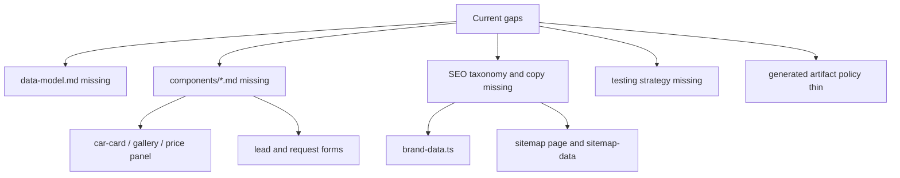

# Wiki Coverage Gaps

This page lists the important parts of the repository that are not yet explained by a dedicated wiki page, so future agents can pick the next documentation target.

The existing wiki covers the system overview, major architecture, ADRs, gotchas, deployment, hot areas, and active task snapshot. It does **not** yet provide component-level references, data schemas, SEO-content ownership, or testing guidance.

## Highest-priority missing pages

| Priority | Missing page | Why it matters | Evidence | Suggested owner |
|---:|---|---|---|---|
| 1 | [data model (planned)](data-model.md) | The app uses several JSON shapes without a schema page: local DB records, cache cars, parsed `CarListing`, sync metadata, and lead JSONL. | `web/src/lib/car-store.ts:10`, `web/src/lib/car-store.ts:17`, `web/scripts/sync-cars.ts:84`, `web/scripts/rebuild-db-from-cache.ts:22`, `web/src/app/api/lead/route.ts:21` | Next agent touching storage or sync. |
| 2 | [catalog components (planned)](components/catalog.md) | The catalog UI is split across cards, filters, gallery, price panel, and a large client component; no page explains prop contracts or user interactions. | `web/src/components/car-card.tsx:10`, `web/src/components/car-card.tsx:14`, `web/src/components/car-gallery.tsx:5`, `web/src/components/price-panel.tsx:7`, `web/src/components/car-filter.tsx:25` | Agent changing catalog UI. |
| 3 | [lead capture component (planned)](components/lead-capture.md) | Two form components post to the same `/api/lead` endpoint with slightly different payloads and status UX. | `web/src/components/request-section.tsx:13`, `web/src/components/request-section.tsx:19`, `web/src/components/request-section.tsx:22`, `web/src/components/lead-form.tsx:44`, `web/src/app/api/lead/route.ts:12` | Agent hardening conversion forms. |
| 4 | [SEO taxonomy (planned)](components/seo-taxonomy.md) | Brand SEO copy, sitemap constants, and filter landing pages are manually maintained in multiple files. | `web/src/lib/brand-data.ts:14`, `web/src/lib/brand-data.ts:752`, `web/src/app/(pages)/sitemap/page.tsx:9`, `web/src/app/(pages)/sitemap/page.tsx:18`, `web/src/app/sitemap-data.ts:5` | Agent adding brands or SEO routes. |
| 5 | [testing strategy (planned)](testing.md) | TypeScript strict mode exists, but there is no declared test script or fixture-based parser test coverage. | `web/tsconfig.json:11`, `web/tsconfig.json:31`, `web/package.json:5`, `web/package.json:9` | Agent introducing tests. |

## Important files with no focused page

This table does not list every file. It names code that a future contributor may need to change but cannot yet load as a focused wiki page.

| File or area | Current coverage | Gap | What a focused page should answer |
|---|---|---|---|
| `web/src/lib/brand-data.ts` | Mentioned indirectly by brand pages and sitemap work. | No page explains the `BrandSEO` contract, supported brands, copy ownership, or how `getBrandSEO()` is used. | Which brands exist, which fields are required, how FAQ/advantage text is rendered, and how to add or remove a brand safely (`web/src/lib/brand-data.ts:1`, `web/src/lib/brand-data.ts:10`, `web/src/lib/brand-data.ts:14`, `web/src/lib/brand-data.ts:752`, `web/src/lib/brand-data.ts:756`). |
| `web/src/app/(pages)/sitemap/page.tsx` | Deployment covers XML sitemap smoke tests; architecture covers sitemap data at a high level. | The human-readable sitemap page duplicates route lists that are also represented in `sitemap-data.ts`. | How manual route arrays map to actual pages, and how to keep HTML sitemap and XML sitemap aligned (`web/src/app/(pages)/sitemap/page.tsx:9`, `web/src/app/(pages)/sitemap/page.tsx:18`, `web/src/app/(pages)/sitemap/page.tsx:36`, `web/src/app/(pages)/sitemap/page.tsx:45`, `web/src/app/sitemap-data.ts:79`). |
| `web/src/components/car-card.tsx` | Gotchas mention booked cars and catalog filtering, but not card behavior. | No component reference explains booked-state UI, image fallback, photo dots, badges, or detail/request actions. | What props are required, how booked cards disable interaction, and which `CarListing` fields are user-visible (`web/src/components/car-card.tsx:10`, `web/src/components/car-card.tsx:20`, `web/src/components/car-card.tsx:25`, `web/src/components/car-card.tsx:55`, `web/src/components/car-card.tsx:163`). |
| `web/src/components/car-gallery.tsx` | Not covered except as part of detail page architecture. | No page documents gallery state, error fallback, and thumbnail behavior. | How `photos` and `alt` should be passed, and what happens when an image fails (`web/src/components/car-gallery.tsx:5`, `web/src/components/car-gallery.tsx:10`, `web/src/components/car-gallery.tsx:20`, `web/src/components/car-gallery.tsx:25`, `web/src/components/car-gallery.tsx:55`). |
| `web/src/components/price-panel.tsx` | Price constants are mentioned as a gotcha, not the UI calculation. | No page explains displayed price semantics, savings estimate, Telegram fallback, or scroll-to-request behavior. | Which prices are raw car prices versus estimated totals, and where the CTA points (`web/src/components/price-panel.tsx:7`, `web/src/components/price-panel.tsx:13`, `web/src/components/price-panel.tsx:14`, `web/src/components/price-panel.tsx:29`, `web/src/components/price-panel.tsx:62`). |
| `web/src/components/request-section.tsx` | Lead route behavior is covered, but the general request form is not. | No page compares general request form payload with car-specific `LeadForm`. | What fields are sent for general requests, how status transitions work, and how errors surface to users (`web/src/components/request-section.tsx:6`, `web/src/components/request-section.tsx:13`, `web/src/components/request-section.tsx:22`, `web/src/components/request-section.tsx:30`, `web/src/components/request-section.tsx:108`). |
| `web/src/components/car-filter.tsx` | The main catalog uses `CatalogClient`; this standalone filter component is not explained. | It may be legacy or reserved UI. No page states whether it is still in the active render path. | Whether `CarFilter` is used, why its brand groups differ from filter route taxonomy, and whether it should be deleted or integrated (`web/src/components/car-filter.tsx:5`, `web/src/components/car-filter.tsx:25`, `web/src/components/car-filter.tsx:54`). |

## Patterns noticed but not yet documented deeply

| Pattern | Where it appears | Why it deserves more documentation | Candidate page |
|---|---|---|---|
| Manual SEO route duplication | HTML sitemap arrays and XML sitemap arrays both enumerate filter families. | Adding one route family requires editing multiple places; the current wiki warns about alignment but does not give a checklist. | [SEO taxonomy (planned)](components/seo-taxonomy.md) |
| UI copy as code | Brand SEO, FAQ, advantages, contact placeholders, and price-panel claims are embedded in TSX/TS files. | Copy changes are code changes. Agents need to know what is factual, what is marketing copy, and what must be verified. | [content model (planned)](content-model.md) |
| Local JSON state without schemas | DB/cache/lead files are written by scripts and APIs, but no runtime validator exists. | Schema drift can break pages silently because readers often return empty data on parse errors. | [data model (planned)](data-model.md) |
| Client-side filtering over partial payloads | `CatalogClient` filters only `initialCars`, while fallback pages often load 200 rows. | This is a product behavior rule, not just a gotcha; it needs examples and expected UX. | [catalog components (planned)](components/catalog.md) |
| Generated artifacts in the working tree | `.next`, `web/data/db/cars.json`, `web/data/cache/*.json`, and `web/data/sync.log` appear in the working tree scan. | Contributors need a policy for what to commit, back up, ignore, or regenerate. | [deployment](deployment.md#rollback) plus [data model (planned)](data-model.md) |

## Open questions for future contributors

| Question | Why it is unanswered | Evidence to start from |
|---|---|---|
| What is the canonical schema for `data/db/cars.json`? | `sync-cars.ts` writes active/booked records, `rebuild-db-from-cache.ts` writes active records from cache, and `car-store.ts` reads both. No schema file or validator exists. | `web/scripts/sync-cars.ts:41`, `web/scripts/sync-cars.ts:84`, `web/scripts/rebuild-db-from-cache.ts:22`, `web/src/lib/car-store.ts:10` |
| Which file owns supported brand taxonomy? | `brand-data.ts`, `encar-api.ts` manufacturer maps, sitemap route arrays, and UI filter groups can drift. | `web/src/lib/brand-data.ts:14`, `web/src/lib/encar-api.ts:10`, `web/src/app/(pages)/sitemap/page.tsx:140`, `web/src/components/car-filter.tsx:6` |
| Are `CarFilter` and other older components still used? | `CarFilter` defines a brand grouping component, while `CatalogClient` implements current filtering internally. | `web/src/components/car-filter.tsx:25`, `web/src/app/catalog/catalog-client.tsx:71`, `web/src/app/catalog/catalog-client.tsx:114` |
| Who owns exchange rates and price claims? | Currency conversion constants are hardcoded in multiple ingestion paths, while UI components display ruble prices and savings estimates. | `web/src/lib/encar-api.ts:6`, `web/scripts/sync-cars.ts:94`, `web/scripts/seed-cache.ts:70`, `web/src/components/price-panel.tsx:29` |
| What is the privacy policy for `data/leads.jsonl`? | The lead route stores name, phone, optional car context, IP header, and timestamp, but no code documents retention or export. | `web/src/app/api/lead/route.ts:21`, `web/src/app/api/lead/route.ts:22`, `web/src/app/api/lead/route.ts:30`, `web/src/app/api/lead/route.ts:31`, `web/src/app/api/lead/route.ts:38` |
| Should image rendering use raw `` or Next Image? | Components use `` directly for cards and gallery, while `next.config.ts` allows `ci.encar.com` for Next Image. | `web/src/components/car-card.tsx:29`, `web/src/components/car-gallery.tsx:21`, `web/next.config.ts:4`, `web/next.config.ts:8` |
| What is the expected test baseline before refactors? | TypeScript strict mode is enabled, but `package.json` has no `test` script. | `web/tsconfig.json:11`, `web/package.json:5`, `web/package.json:9` |

## Thin sections in existing pages

These sections are useful but should grow when the relevant code is next touched.

| Existing area | What is thin | How to expand without duplicating |
|---|---|---|
| Deployment rollback | It tells operators to restore `cars.json`, but does not specify backup naming, retention, or verification commands. | Add backup/restore examples after a real backup convention exists; cite `sync-cars.ts` and `car-store.ts`. |
| Gotchas for privacy/security | It flags lead-file abuse, but does not define retention, masking, or export rules. | Add a privacy subsection after a code or policy change defines how `data/leads.jsonl` is handled. |
| Architecture module table | It orients readers, but does not provide component APIs. | Create `components/*.md` pages instead of expanding `architecture.md`. |
| Active areas | It uses local reflog and sync logs because `_git-signals.md` is absent. | Replace with commit-frequency/churn data when the pipeline emits `_git-signals.md`. |

## Recommended next writing order

1. **[data model (planned)](data-model.md)** — highest leverage because DB/cache/lead schemas affect sync, pages, deployment, and gotchas.
2. **[catalog components (planned)](components/catalog.md)** — explains `CatalogClient`, `CarCard`, `CarGallery`, `PricePanel`, and route payload assumptions.
3. **[lead capture component (planned)](components/lead-capture.md)** — documents `LeadForm`, `RequestSection`, `/api/lead`, payloads, and privacy implications.
4. **[SEO taxonomy (planned)](components/seo-taxonomy.md)** — documents brand SEO, sitemap arrays, filter landing pages, and route-alignment checks.
5. **[testing strategy (planned)](testing.md)** — defines the minimum tests needed before refactoring parser and catalog behavior.

## See also

- [architecture: boundaries for safe changes](architecture.md#boundaries-for-safe-changes) — where schema and component changes cross file boundaries.
- [gotchas: client filters only operate on the initial server payload](gotchas.md#client-filters-only-operate-on-the-initial-server-payload) — one behavior that deserves component documentation.
- [deployment: rollback](deployment.md#rollback) — operational coverage that should grow after backup policy is defined.

## Backlinks

- [active-tasks](./active-tasks.md)
