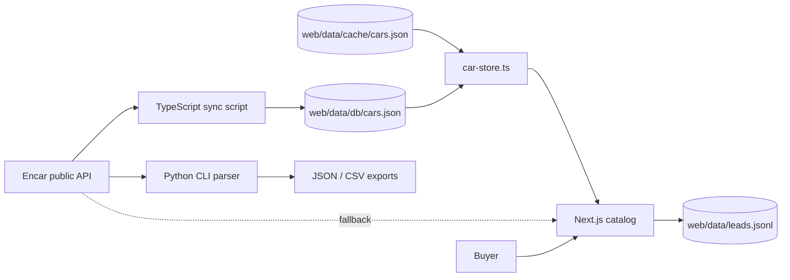

# Encar Parser Overview

This repository combines an Encar.com data parser, a local JSON-backed car store, and a Russian-language Next.js catalog for Korean used cars.

## What this system is

The project has two runnable surfaces. The root Python parser fetches Encar listings from `https://api.encar.com/search/car/list/premium`, maps raw records to `CarListing`, and exports JSON or CSV (`encar_parser.py:25`, `encar_parser.py:68`, `encar_parser.py:287`, `encar_parser.py:295`). The `web/` app is a Next.js 16 site named `encar-korea` that serves the catalog, landing page, lead form, sitemap, and data sync scripts (`web/package.json:2`, `web/package.json:6`, `web/package.json:19`).

The business product is a lead-generation catalog for importing cars from Korea to Russia. The home page renders pricing comparisons, a process section, live catalog preview, brand grid, calculator, case studies, guarantees, FAQ, and request sections (`web/src/app/page.tsx:17`, `web/src/app/page.tsx:77`, `web/src/app/page.tsx:182`, `web/src/app/page.tsx:187`, `web/src/app/page.tsx:208`). Vehicle prices are normalized from Korean won to rubles in TypeScript with fixed conversion constants (`web/src/lib/encar-api.ts:6`, `web/src/lib/encar-api.ts:177`, `web/src/lib/encar-api.ts:213`).

> [!IMPORTANT]
> Treat this as a file-backed catalog, not a database-backed app. `web/src/lib/car-store.ts` reads `data/db/cars.json` from `process.cwd()` and falls back to `data/cache/cars.json` when the DB file is missing (`web/src/lib/car-store.ts:7`, `web/src/lib/car-store.ts:40`, `web/src/lib/car-store.ts:41`, `web/src/lib/car-store.ts:42`).

## System context

The normal production path is `sync-cars.ts` → `data/db/cars.json` → `car-store.ts` → server-rendered Next.js pages. The fallback path calls Encar directly when the local store is empty: the home page fetches 8 preview cars and 200 cars for brand counts (`web/src/app/page.tsx:77`, `web/src/app/page.tsx:86`, `web/src/app/page.tsx:87`), the catalog page fetches 200 cars (`web/src/app/catalog/page.tsx:12`, `web/src/app/catalog/page.tsx:15`), and brand pages use API stats when local stats are empty (`web/src/app/catalog/[brand]/page.tsx:45`, `web/src/app/catalog/[brand]/page.tsx:49`).

## Runtime pieces

| Piece | Location | What it does | Evidence |
|---|---|---|---|
| Python parser library | `encar_parser.py` | Builds Encar query strings, pages through API results, maps records, and exports JSON/CSV. | `encar_parser.py:137`, `encar_parser.py:150`, `encar_parser.py:189`, `encar_parser.py:212`, `encar_parser.py:287` |
| Python CLI | `run.py` | Exposes parser filters for max count, page size, sort, manufacturer, fuel, price, mileage, year, car type, JSON, and CSV. | `run.py:31`, `run.py:54`, `run.py:64`, `run.py:81`, `run.py:91` |
| Next.js web app | `web/` | Runs `next dev`, `next build`, and `next start` on port `3850`. | `web/package.json:5`, `web/package.json:6`, `web/package.json:7`, `web/package.json:8` |
| Encar API adapter | `web/src/lib/encar-api.ts` | Converts raw Encar records into typed `CarListing` objects and fetches filtered API results. | `web/src/lib/encar-api.ts:121`, `web/src/lib/encar-api.ts:173`, `web/src/lib/encar-api.ts:299` |
| Local car store | `web/src/lib/car-store.ts` | Reads local JSON, caches it in memory for 60 seconds, and exposes active/booked cars plus brand stats. | `web/src/lib/car-store.ts:31`, `web/src/lib/car-store.ts:32`, `web/src/lib/car-store.ts:79`, `web/src/lib/car-store.ts:89`, `web/src/lib/car-store.ts:138` |
| Sync job | `web/scripts/sync-cars.ts` | Downloads Encar data in batches, marks disappeared cars as `booked`, expires old booked records, and writes the local DB. | `web/scripts/sync-cars.ts:31`, `web/scripts/sync-cars.ts:200`, `web/scripts/sync-cars.ts:277`, `web/scripts/sync-cars.ts:311`, `web/scripts/sync-cars.ts:330` |
| Lead capture API | `web/src/app/api/lead/route.ts` | Validates `name` and `phone`, then appends JSONL lead records under `web/data`. | `web/src/app/api/lead/route.ts:5`, `web/src/app/api/lead/route.ts:8`, `web/src/app/api/lead/route.ts:14`, `web/src/app/api/lead/route.ts:38` |
| Sitemap surface | `web/src/app/sitemap-data.ts`, `web/src/app/api/sitemap-xml/route.ts` | Generates static sitemap entries and an XML route with stylesheet reference. | `web/src/app/sitemap-data.ts:27`, `web/src/app/sitemap-data.ts:79`, `web/src/app/api/sitemap-xml/route.ts:4`, `web/src/app/api/sitemap-xml/route.ts:19` |

## Data acquisition model

Both parser implementations target the same Encar search endpoint. The Python module defines `API_BASE`, `SEARCH_ENDPOINT`, `PHOTO_BASE`, and `DETAIL_URL` constants (`encar_parser.py:25`, `encar_parser.py:26`, `encar_parser.py:27`, `encar_parser.py:28`). The TypeScript adapter mirrors those constants in the web app (`web/src/lib/encar-api.ts:1`, `web/src/lib/encar-api.ts:2`, `web/src/lib/encar-api.ts:3`, `web/src/lib/encar-api.ts:4`).

Query construction uses Encar's `q=(And....)` syntax. The Python parser starts with `Hidden.N`, optionally adds car type, manufacturer, fuel, price, mileage, and year filters, then joins them with `._.` (`encar_parser.py:150`, `encar_parser.py:161`, `encar_parser.py:163`, `encar_parser.py:186`). The web adapter uses the same pattern and encodes the query into a `count=true` URL with an `sr=|sort|0|limit` segment (`web/src/lib/encar-api.ts:317`, `web/src/lib/encar-api.ts:348`, `web/src/lib/encar-api.ts:349`, `web/src/lib/encar-api.ts:351`).

The TypeScript adapter is optimized for page rendering. It limits image galleries to 10 photos, maps Korean fuel and transmission labels to Russian, generates slugs, and requests Next.js revalidation every 600 seconds (`web/src/lib/encar-api.ts:183`, `web/src/lib/encar-api.ts:187`, `web/src/lib/encar-api.ts:195`, `web/src/lib/encar-api.ts:216`, `web/src/lib/encar-api.ts:356`). The Python parser is optimized for ad-hoc export and sleeps between pages when `delay` is positive (`encar_parser.py:256`, `encar_parser.py:260`, `encar_parser.py:280`).

## Local store and freshness model

`car-store.ts` is the read boundary for production pages. It reads `data/db/cars.json` into an in-memory cache and returns cached data for 60 seconds (`web/src/lib/car-store.ts:31`, `web/src/lib/car-store.ts:32`, `web/src/lib/car-store.ts:34`, `web/src/lib/car-store.ts:36`). If `data/db/cars.json` does not exist but `data/cache/cars.json` exists, it wraps cached cars as active records and returns a fallback DB shape (`web/src/lib/car-store.ts:41`, `web/src/lib/car-store.ts:49`, `web/src/lib/car-store.ts:54`). If both reads fail, it returns an empty store (`web/src/lib/car-store.ts:69`, `web/src/lib/car-store.ts:74`).

The sync script makes the local DB look more like a marketplace. It fetches up to `MAX_TOTAL = 20000` cars in `BATCH_SIZE = 50` chunks and splits the budget 75% Korean car type `Y` and 25% imported car type `N` (`web/scripts/sync-cars.ts:31`, `web/scripts/sync-cars.ts:32`, `web/scripts/sync-cars.ts:33`, `web/scripts/sync-cars.ts:215`, `web/scripts/sync-cars.ts:216`). Cars that disappear from Encar become `booked`, but the script caps that synthetic booked list with `BOOKED_RATIO = 0.06`, `MAX_BOOKED = 30`, and `BOOKED_TTL_H = 24` (`web/scripts/sync-cars.ts:36`, `web/scripts/sync-cars.ts:37`, `web/scripts/sync-cars.ts:38`, `web/scripts/sync-cars.ts:277`, `web/scripts/sync-cars.ts:330`).

> [!WARNING]
> Do not assume `booked` means a confirmed buyer exists. The sync job derives it from listings that disappear from Encar, then intentionally limits the count for display (`web/scripts/sync-cars.ts:277`, `web/scripts/sync-cars.ts:280`, `web/scripts/sync-cars.ts:283`).

## Web request model

Most public pages prefer the local JSON store, then fall back to direct Encar calls. This keeps pages usable when the nightly sync has populated `data/db/cars.json`, but also lets a fresh checkout render dynamic data.

| Route family | Data source order | Purpose | Evidence |
|---|---|---|---|
| `/` | `getCarsWithBooked(8)` and `getAllCars()`, then `fetchCars()` if empty | Landing page with preview catalog and brand counts. | `web/src/app/page.tsx:77`, `web/src/app/page.tsx:79`, `web/src/app/page.tsx:86`, `web/src/app/page.tsx:87` |
| `/catalog` | `getCarsWithBooked()`, then `fetchCars({ limit: 200 })` | Full catalog shell with client filters. | `web/src/app/catalog/page.tsx:12`, `web/src/app/catalog/page.tsx:13`, `web/src/app/catalog/page.tsx:16` |
| `/catalog/[brand]` | `getStoreBrandStats()` and `getCarsByBrand()`, then `fetchBrandStats()` | Brand landing pages with SEO copy, stats, catalog, FAQ, and CTA. | `web/src/app/catalog/[brand]/page.tsx:18`, `web/src/app/catalog/[brand]/page.tsx:45`, `web/src/app/catalog/[brand]/page.tsx:49`, `web/src/app/catalog/[brand]/page.tsx:151` |
| `/catalog/[brand]/[carId]` | `getCarById()`, then `fetchCarById()` | Vehicle detail page with gallery, price panel, specs, schema, and similar cars. | `web/src/app/catalog/[brand]/[carId]/page.tsx:38`, `web/src/app/catalog/[brand]/[carId]/page.tsx:39`, `web/src/app/catalog/[brand]/[carId]/page.tsx:165`, `web/src/app/catalog/[brand]/[carId]/page.tsx:205` |
| Filter landing pages | Local filtered store, then filtered `fetchCars()` | SEO landing pages for saved filter concepts, such as electric cars. | `web/src/app/catalog/(filters)/electric/page.tsx:12`, `web/src/app/catalog/(filters)/electric/page.tsx:13`, `web/src/app/catalog/(filters)/electric/page.tsx:18`, `web/src/app/catalog/(filters)/electric/page.tsx:49` |

Client-side catalog filtering happens after the server provides an initial car array. `CatalogClient` reads URL query parameters, builds query strings, applies filters in memory, and sorts by date, price, year, or mileage (`web/src/app/catalog/catalog-client.tsx:1`, `web/src/app/catalog/catalog-client.tsx:71`, `web/src/app/catalog/catalog-client.tsx:85`, `web/src/app/catalog/catalog-client.tsx:114`, `web/src/app/catalog/catalog-client.tsx:132`). This means the UI filter set only covers the current `initialCars` payload; it does not query the server for every filter change.

## Public API surface

The app exposes three notable HTTP surfaces:

1. `GET /api/cars` proxies live Encar search results. It accepts `manufacturer` and `limit`, caps `limit` at 200, returns `{ cars, total }`, and converts failures into HTTP 500 (`web/src/app/api/cars/route.ts:4`, `web/src/app/api/cars/route.ts:6`, `web/src/app/api/cars/route.ts:7`, `web/src/app/api/cars/route.ts:10`, `web/src/app/api/cars/route.ts:14`).
2. `POST /api/lead` captures customer contacts. It requires `name` and `phone`, stores optional car context, records forwarding IP headers, and appends one JSON object per line to `data/leads.jsonl` (`web/src/app/api/lead/route.ts:8`, `web/src/app/api/lead/route.ts:12`, `web/src/app/api/lead/route.ts:14`, `web/src/app/api/lead/route.ts:21`, `web/src/app/api/lead/route.ts:30`, `web/src/app/api/lead/route.ts:38`).
3. `GET /api/sitemap-xml` renders XML from the shared sitemap entries and sets one-hour public cache headers (`web/src/app/api/sitemap-xml/route.ts:4`, `web/src/app/api/sitemap-xml/route.ts:5`, `web/src/app/api/sitemap-xml/route.ts:19`, `web/src/app/api/sitemap-xml/route.ts:25`, `web/src/app/api/sitemap-xml/route.ts:28`).

The browser lead form calls `/api/lead` with `name`, `phone`, `comment`, `carId`, title, year, price, and mileage when a car is selected (`web/src/components/lead-form.tsx:37`, `web/src/components/lead-form.tsx:44`, `web/src/components/lead-form.tsx:47`, `web/src/components/lead-form.tsx:51`).

## Technology stack

| Layer | Stack | Evidence |
|---|---|---|
| Web framework | Next.js `^16.2.1`, React `^19.2.4`, React DOM `^19.2.4` | `web/package.json:19`, `web/package.json:21`, `web/package.json:22` |
| Styling toolchain | Tailwind CSS `^4.2.2` and `@tailwindcss/postcss` | `web/package.json:15`, `web/package.json:24` |
| Type checking/runtime helpers | TypeScript `^6.0.2`, `server-only` | `web/package.json:23`, `web/package.json:25`, `web/src/lib/car-store.ts:1` |
| Python parser | `requests` and `fake-useragent` | `requirements.txt:1`, `requirements.txt:2`, `encar_parser.py:16`, `encar_parser.py:17` |
| Deployment process | PM2-style ecosystem config starts one forked Next process on port 3850 | `web/ecosystem.config.cjs:1`, `web/ecosystem.config.cjs:6`, `web/ecosystem.config.cjs:7`, `web/ecosystem.config.cjs:13`, `web/ecosystem.config.cjs:14` |
| Remote images | Next Image allows `https://ci.encar.com` | `web/next.config.ts:3`, `web/next.config.ts:4`, `web/next.config.ts:5`, `web/next.config.ts:8` |

## Start points for a new coding agent

Use the file that owns the behavior you want to change:

- Change live Encar query mapping in `web/src/lib/encar-api.ts`; it owns manufacturer maps, labels, `CarListing`, parsing, filters, and fetches (`web/src/lib/encar-api.ts:10`, `web/src/lib/encar-api.ts:86`, `web/src/lib/encar-api.ts:121`, `web/src/lib/encar-api.ts:173`, `web/src/lib/encar-api.ts:299`).
- Change local DB semantics in `web/src/lib/car-store.ts` and `web/scripts/sync-cars.ts`; store reads and sync writes must agree on `status`, `bookedAt`, and `parsed` shapes (`web/src/lib/car-store.ts:10`, `web/src/lib/car-store.ts:17`, `web/scripts/sync-cars.ts:41`, `web/scripts/sync-cars.ts:84`).
- Change catalog UI filtering in `web/src/app/catalog/catalog-client.tsx`; it is a client component with URL helper functions, filter predicates, and sorting logic (`web/src/app/catalog/catalog-client.tsx:1`, `web/src/app/catalog/catalog-client.tsx:31`, `web/src/app/catalog/catalog-client.tsx:71`, `web/src/app/catalog/catalog-client.tsx:114`).
- Change lead capture in both `web/src/components/lead-form.tsx` and `web/src/app/api/lead/route.ts`; the client payload and server JSONL schema are coupled (`web/src/components/lead-form.tsx:47`, `web/src/app/api/lead/route.ts:12`, `web/src/app/api/lead/route.ts:21`).
- Change offline exports in the root Python parser; `run.py` wires CLI arguments into `EncarParser.parse()`, then calls `save_json()` or `save_csv()` (`run.py:91`, `run.py:93`, `run.py:110`, `run.py:113`).

## See also

- [architecture (planned)](architecture.md) — system-level constraints and trade-offs.
- [data model (planned)](data-model.md) — JSON DB, cache, lead, and listing shapes.
- [deployment (planned)](deployment.md) — PM2 process, sync job, and operational paths.
- [gotchas (planned)](gotchas.md) — API, cache, and JSON-file failure modes.

## Backlinks

- [architecture](./architecture.md)
- [decisions](./decisions.md)
- [deployment](./deployment.md)
